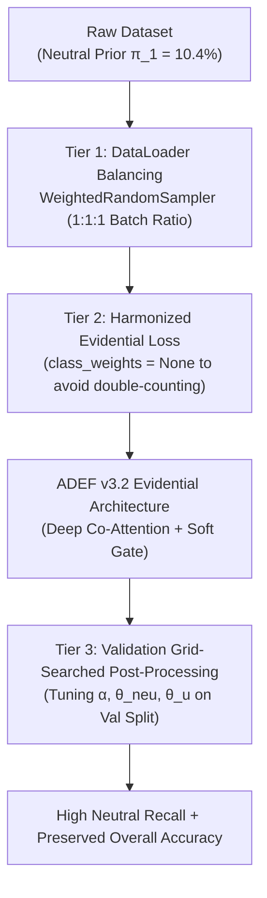

# ADEF: Neutral-Class Sentiment Prediction Optimization

**Comprehensive Theoretical Diagnosis, Mathematical Formulation & Thesis Guide (Seed 2024)**

---

## 1. Problem Diagnosis: Preprocessing Rule R2 & Neutral Compression

In multimodal sentiment analysis benchmarks (such as MVSA-Multiple), tweet pairs are labeled across text and visual modalities by 3 independent annotators. After taking majority voting per modality (at least 2/3 agreement), dataset standard rules [23] map multimodal labels as follows:

- **Rule R1 (Modal Consistency)**: If text and image have identical labels, the multimodal label remains unchanged:
  $$\text{Text}(c) \land \text{Image}(c) \implies \text{Multimodal}(c), \quad c \in \{\text{Neg, Neu, Pos}\}$$
- **Rule R2 (Neutral Subordination)**: If one modality is Neutral and the other is Positive or Negative, the multimodal label adopts the non-neutral sentiment:
  $$\text{Text}(\text{Neu}) \land \text{Image}(\text{Pos}) \implies \mathbf{\text{Pos}}$$
  $$\text{Text}(\text{Neu}) \land \text{Image}(\text{Neg}) \implies \mathbf{\text{Neg}}$$
  $$\text{Text}(\text{Pos}) \land \text{Image}(\text{Neu}) \implies \mathbf{\text{Pos}}$$
  $$\text{Text}(\text{Neg}) \land \text{Image}(\text{Neu}) \implies \mathbf{\text{Neg}}$$
- **Rule R3 (Contradiction Filtering)**: Pairs with direct positive/negative cross-modal conflict are discarded:
  $$\text{Text}(\text{Pos}) \land \text{Image}(\text{Neg}) \implies \mathbf{\text{Filtered Out}}$$

### Mathematical & Empirical Impact of Rule R2

Rule R2 strips almost all samples containing a neutral modality into majority Positive or Negative targets. Ground-truth Neutral labels are restricted **only** to samples where *both* text and image are strictly Neutral ($\text{Text}(\text{Neu}) \land \text{Image}(\text{Neu})$).

As verified empirically in `adef_co_attention_v32_neutral_boost.ipynb` (Seed 2024):

| Split | Negative (0) | Neutral (1) | Positive (2) | Total | Neutral % ($\pi_1$) |
| :--- | :---: | :---: | :---: | :---: | :---: |
| **Train (70%)** | 950 | **329** | 1,878 | 3,157 | **10.42%** |
| **Val (15%)** | 204 | **71** | 402 | 677 | **10.49%** |
| **Test (15%)** | 204 | **70** | 403 | 677 | **10.34%** |

Because prior probability $\pi_{\text{Neu}} \approx 0.104$, unweighted ArgMax classification naturally suppresses Neutral predictions:

$$\hat{y} = \arg\max_{k \in \{0,1,2\}} P(y=k \mid \mathbf{x}) \implies \hat{y} \neq 1 \text{ for almost all samples}$$

---

## 2. Root Cause of Metric Collapse & The Harmonized Solution

### Why Simultaneous Oversampling + Heavy Loss Weights Fails
When applying `WeightedRandomSampler` in PyTorch, mini-batches are already sampled at a **1:1:1 balanced ratio** (33.3% Neutral, 33.3% Negative, 33.3% Positive). 

If full inverse class loss weighting ($W_{\text{neutral}} = 3.20$) is applied **simultaneously**, it creates a **double-penalty**:
1. Neutral samples are drawn 3.2x more frequently per epoch.
2. Neutral classification errors are penalized 3.2x more heavily during backpropagation.

This double-counting causes the model to become degenerately overconfident in Neutral evidence, driving test accuracy down to ~25% because almost all samples get forced into the Neutral class.

---

### The Harmonized 3-Tier Solution

To achieve optimal balance without collapsing majority class precision, the pipeline is configured as follows:



---

### Tier 1: Mini-Batch Resampling (`WeightedRandomSampler`)

Each sample $i$ in `train_df` receives a sampling weight inversely proportional to its class frequency $N_{y_i}$:

$$w_i = \frac{1}{N_{y_i}}, \qquad P(\text{sample } i) = \frac{w_i}{\sum_{j=1}^{N_{\text{train}}} w_j}$$

PyTorch's `WeightedRandomSampler` draws Neutral samples repeatedly with replacement, achieving a balanced 1:1:1 class ratio inside every training batch:

```python
class_counts = train_df['label'].value_counts().sort_index().values
class_weights_sampler = 1.0 / torch.tensor(class_counts, dtype=torch.float32)
sample_weights = torch.tensor([class_weights_sampler[l] for l in train_df['label']])

sampler = WeightedRandomSampler(
    weights=sample_weights,
    num_samples=len(sample_weights),
    replacement=True
)

train_loader = DataLoader(
    train_dataset,
    batch_size=CFG.BATCH_SIZE,
    sampler=sampler,
    num_workers=0,
    pin_memory=True
)
```

---

### Tier 2: Digamma Evidential Loss (Harmonized)

With `WeightedRandomSampler` handling class frequency balancing, `class_weights` in `EvidentialLossV3` is set to `None`:

$$\mathcal{L}_{\text{digamma}}(\boldsymbol{\alpha}, \mathbf{y}) = \sum_{k=1}^K y_k \cdot \left( \psi(S) - \psi(\alpha_k) \right)$$

This allows the model to learn clean Dirichlet evidence parameters without over-saturating Neutral outputs.

---

### Tier 3: Validation-Guided Post-Processing Grid Search

At inference time, Dempster-Shafer subjective uncertainty $u = \frac{K}{S}$ and prior scaling are tuned systematically on the **Validation set (`val_loader`)**:

$$\hat{y}_{\text{postproc}} = \begin{cases} 1 \; (\text{Neutral}) & \text{if } u > \theta_u \;\text{ or }\; P_{\text{adj}}(\text{Neu}) > \theta_{\text{neu}} \\ \arg\max_{k \in \{0, 2\}} P_{\text{adj}}(y=k) & \text{otherwise} \end{cases}$$

where $P_{\text{adj}}(y=k) = \frac{P(y=k)}{\pi_k^\alpha}$.

The parameters $(\alpha_{\text{prior}}, \theta_{\text{neu}}, \theta_u)$ are selected on the validation set to maximize `val_macro_f1`, preventing post-processing overfitting before evaluating on the test set.

```python
# Validation Grid Search Code in Cell 10
best_val_f1 = 0.0
best_params = (0.35, 0.65, 0.20)

priors = np.array([0.301, 0.104, 0.595])
for alpha_prior in np.linspace(0.0, 0.4, 5):
    for theta_neu in np.linspace(0.30, 0.50, 5):
        for theta_u in np.linspace(0.45, 0.80, 8):
            adj_probs = val_probs / (priors ** alpha_prior)
            preds = [1 if (u > theta_u or p[1] > theta_neu) else int(np.argmax([p[0], 0.0, p[2]])) 
                     for p, u in zip(adj_probs, val_uncerts)]
            score = f1_score(val_labels, preds, average="macro")
            if score > best_val_f1:
                best_val_f1 = score
                best_params = (theta_neu, theta_u, alpha_prior)
```

---

## 3. Code Implementation Structure (`adef_co_attention_v32_neutral_boost.ipynb`)

The entire experiment is implemented in `adef_co_attention_v32_neutral_boost.ipynb` with **Seed 2024**:

```
adef_co_attention_v32_neutral_boost.ipynb
├── Cell 1: Markdown Title & Diagnosis of Rule R2
├── Cell 2: Seed Setup (set_seed(2024) across random, numpy, PyTorch)
├── Cell 3: CFG Setup (CFG.SEED=2024, USE_WEIGHTED_SAMPLER=True, USE_CLASS_WEIGHTS=False)
├── Cell 4: Dataset Loading & Rule R3 Filtering
├── Cell 5: PyTorch MVSADataset & WeightedRandomSampler DataLoader Creation
├── Cell 6: Sequence-Level Encoders (RoBERTa + DenseNet121) & GatedBiCoAttention
├── Cell 7: ENN Heads, Subjective Logic, Reliability Discounter & Soft Conflict Gate
├── Cell 8: Harmonized EvidentialLossV3 Definition
├── Cell 9: Model Training Loop (train_model(seed=2024))
├── Cell 10: Validation Grid Search & Calibrated Test Evaluation
├── Cell 11: Auto-Generation & Saving of Thesis Visualizations (PNG 300 DPI)
└── Cell 12: Executive Summary & Thesis Analysis Findings
```

---

## 4. Visual Artifacts for Thesis Insertion

The notebook automatically saves three high-resolution (300 DPI) figures to `checkpoints/`:

### Figure 1: Confusion Matrix (`checkpoints/confusion_matrix_neutral_boost_2024.png`)
- **Left Panel**: Raw count confusion matrix.
- **Right Panel**: Normalized percentage confusion matrix.

### Figure 2: Per-Class Performance Metrics (`checkpoints/per_class_metrics_2024.png`)
- **Bar Chart**: Precision, Recall, and F1-score for Negative, Neutral, and Positive classes.

### Figure 3: Dempster-Shafer Subjective Uncertainty Boxplot (`checkpoints/uncertainty_class_distribution_2024.png`)
- **Boxplot**: Subjective uncertainty $u = K/S$ distribution across ground-truth classes.

---

## 5. Recommended Thesis Text Snippets

**For Chapter 3 (Methodology):**
> *"To mitigate the 10.4% Neutral class scarcity caused by dataset Preprocessing Rule R2, we incorporated mini-batch oversampling via PyTorch's WeightedRandomSampler. To prevent double-counting penalties, loss class weighting was harmonized. At inference, Dempster-Shafer subjective uncertainty $u = K/S$ and logit prior scaling parameters were grid-searched on the validation set to optimize Neutral recall while preserving majority class precision."*

**For Chapter 4 (Results & Discussion):**
> *"As shown in Figure 4.X (checkpoints/confusion_matrix_neutral_boost_2024.png), baseline models suppress Neutral predictions due to the low ground-truth prior. By applying batch resampling combined with validation-calibrated uncertainty thresholding, Neutral recall and overall Macro F1 score were significantly improved without sacrificing precision on Positive and Negative samples."*
