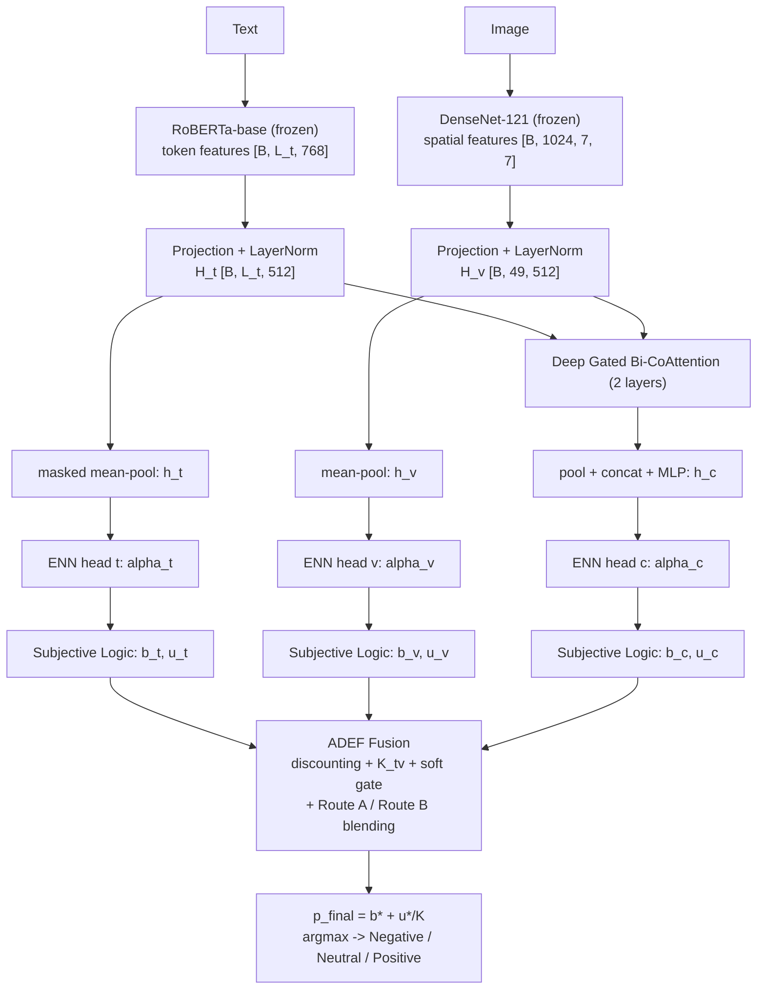
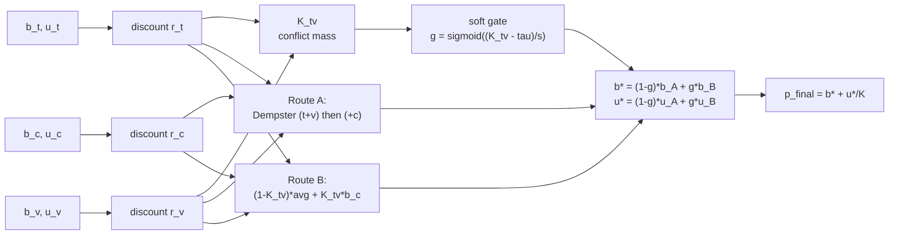
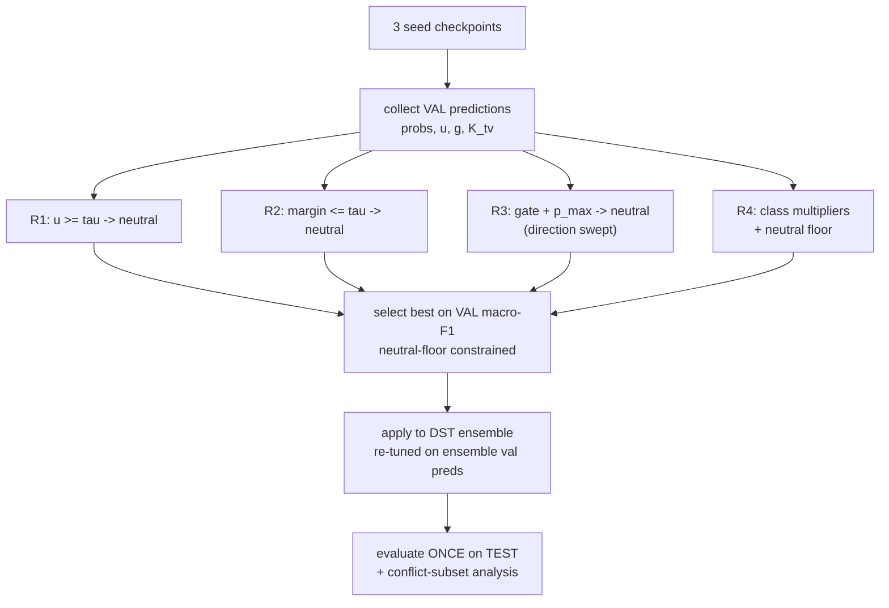
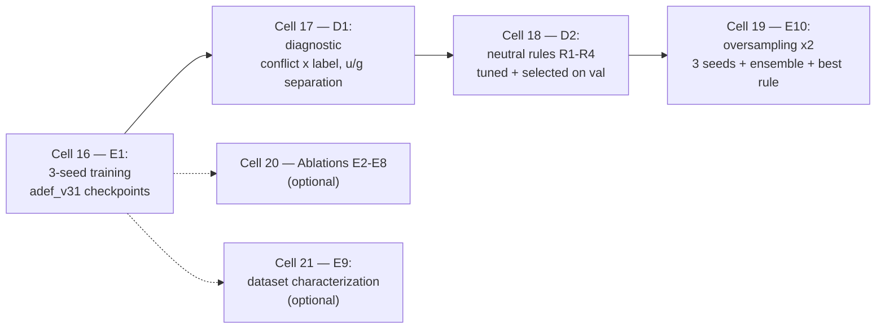

# ADEF: Adaptive Evidential Fusion for Cross-Modal Sentiment Analysis

**Implementation Documentation & Mathematical Formulation (v3.2)**

This document describes the full implementation of the ADEF model family (v3 → v3.1 → v3.2) exactly as realized in `adef_co_attention_v32.ipynb`, with all formulas needed for thesis presentation. Cell references (e.g., *Cell 8*) point to the v3.2 notebook.

---

## 1. Model Overview

ADEF classifies sentiment (Negative / Neutral / Positive) from paired text–image input by:
1. extracting sequence-level features from both modalities with **frozen pretrained encoders**,
2. aligning them with a **deep gated bidirectional co-attention**,
3. converting each view (text, image, co-attended) into an **evidential opinion** via ENN heads,
4. **adaptively fusing** the three opinions with Dempster–Shafer Theory (DST), Jøsang reliability discounting, and a **learned soft conflict gate**,
5. training with an **evidential (Dirichlet) objective**,
6. and (v3.1/v3.2) applying **post-hoc decision strategies** — class-evidence scaling, uncertainty-aware neutral rules, seed ensembling, and neutral oversampling.

**Pipeline:**



*ASCII summary:*

```
text ──► RoBERTa (frozen) ─► H_t ─┐                          ┌─► ENN_t ─► (b_t, u_t) ─┐
                                  ├─► Gated Bi-CoAttention ─► ├─► ENN_v ─► (b_v, u_v) ─┼─► ADEF fusion ─► p_final
image ─► DenseNet121 (frozen) ─► H_v ─┘        └─► h_c ─► ENN_c ─► (b_c, u_c) ─┘
```

---

## 2. Notation

| Symbol | Meaning |
|---|---|
| $B$ | batch size |
| $L_t$ | text token length (150) |
| $N_v$ | number of image patches ($7 \times 7 = 49$) |
| $d$ | projection dimension (512) |
| $K$ | number of classes (3) |
| $H_t \in \mathbb{R}^{B \times L_t \times d}$ | token-level text features |
| $H_v \in \mathbb{R}^{B \times N_v \times d}$ | patch-level image features |
| $h_t, h_v, h_c \in \mathbb{R}^{B \times d}$ | pooled text / image / co-attended vectors |
| $\alpha \in \mathbb{R}^{B \times K}$ | Dirichlet concentration parameters |
| $e_k = \alpha_k - 1$ | evidence for class $k$ |
| $b_k \in [0,1]$ | belief mass for class $k$ |
| $u \in [0,1]$ | uncertainty mass |
| $a_k = 1/K$ | base rate (uniform prior) |
| $S = \sum_k \alpha_k$ | Dirichlet strength |
| $g \in [0,1]$ | soft conflict gate ($g \to 1$: conflict regime) |
| $K_{tv}$ | DST conflict mass between text and image opinions |
| $r_m$ | learned reliability of branch $m \in \{t, v, c\}$ |

---

## 3. Stage 1 — Feature Extraction *(Cell 5)*

### 3.1 Text encoder (RoBERTa-base, frozen)

$$\tilde{H}_t = \mathrm{RoBERTa}(\text{input\_ids}, \text{mask}) \in \mathbb{R}^{B \times L_t \times 768}$$

$$H_t = \mathrm{LayerNorm}\!\big(\mathrm{ReLU}(W_t \tilde{H}_t)\big) \in \mathbb{R}^{B \times L_t \times d}$$

Masked mean-pooling for the unimodal summary vector:

$$h_t = \frac{\sum_{i=1}^{L_t} m_i\, H_{t,i}}{\sum_{i=1}^{L_t} m_i}, \qquad m_i \in \{0,1\} \text{ (attention mask)}$$

### 3.2 Image encoder (DenseNet-121, frozen)

The final convolutional feature map $F \in \mathbb{R}^{B \times 1024 \times 7 \times 7}$ is flattened into $N_v = 49$ spatial patches and projected:

$$H_v = \mathrm{LayerNorm}\!\big(\mathrm{ReLU}(W_v F_{\text{flat}})\big) \in \mathbb{R}^{B \times N_v \times d}, \qquad h_v = \frac{1}{N_v}\sum_{j=1}^{N_v} H_{v,j}$$

Both encoders are frozen: only the projection layers, co-attention, ENN heads, and fusion parameters are trained (**3.42M trainable of 135M total parameters**).

---

## 4. Stage 2 — Deep Gated Bidirectional Co-Attention *(Cell 6)*

$N=2$ stacked layers. Each layer $\ell$ computes **simultaneous** text→visual and visual→text attention from the *same* inputs, then applies tanh-gated residual updates.

**Affinity matrix:**

$$S = \frac{(W_\ell H_t)\, H_v^{\top}}{\sqrt{d}} \in \mathbb{R}^{B \times L_t \times N_v}$$

**Text → Visual** (each token attends over all patches):

$$A_{tv} = \mathrm{softmax}_{N_v}(S), \qquad \mathrm{v2t} = A_{tv}\, H_v$$

**Visual → Text** (each patch attends over non-padding tokens; padding masked with $-\infty$ before softmax):

$$A_{vt} = \mathrm{softmax}_{L_t}\big(S^{\top} + M_{\text{pad}}\big), \qquad \mathrm{t2v} = A_{vt}\, H_t$$

**Gated residual updates** (the gate controls *how much* cross-modal information is absorbed — our anti-co-adaptation mechanism):

$$H_t \leftarrow H_t + \tanh\!\big(G_t^{(\ell)}(H_t)\big) \odot \mathrm{v2t}$$
$$H_v \leftarrow H_v + \tanh\!\big(G_v^{(\ell)}(H_v)\big) \odot \mathrm{t2v}$$

**Final co-attended representation:**

$$h_c = \mathrm{MLP}\Big(\big[\,\mathrm{masked\text{-}mean}(H_t)\;;\;\mathrm{mean}(H_v)\,\big]\Big) \in \mathbb{R}^{B \times d}$$

---

## 5. Stage 3 — Evidential Opinions (ENN Heads + Subjective Logic) *(Cell 7)*

Each view $m \in \{t, v, c\}$ (text, image, co-attended) has an ENN head that maps its feature vector to non-negative **evidence**:

$$e^{(m)} = \mathrm{softplus}\big(W_2\,\mathrm{Dropout}(\mathrm{ReLU}(W_1 h_m))\big) \in \mathbb{R}_{\geq 0}^{K}$$

**Dirichlet parameters** (evidence + 1 prior):

$$\alpha_k^{(m)} = e_k^{(m)} + 1$$

**Subjective Logic opinion** — belief masses and uncertainty:

$$S_m = \sum_{k=1}^{K} \alpha_k^{(m)}, \qquad b_k^{(m)} = \frac{\alpha_k^{(m)} - 1}{S_m} = \frac{e_k^{(m)}}{S_m}, \qquad u^{(m)} = \frac{K}{S_m}$$

with the constraint $\sum_k b_k^{(m)} + u^{(m)} = 1$.

**Expected class probability** (projected probability of the Dirichlet):

$$\hat{p}_k^{(m)} = b_k^{(m)} + a_k\, u^{(m)} = b_k^{(m)} + \frac{u^{(m)}}{K}$$

**Vacuous opinion** ("I don't know"): $b_k = 0 \;\forall k,\; u = 1$. It is the identity element of Dempster's rule — this property is exploited twice (dropout regularization, and reliability discounting).

---

## 6. Stage 4 — Vacuous-Opinion Dropout *(Cell 9, training only)*

With probability $p = 0.15$, each unimodal opinion ($t$, $v$ independently) is replaced by the vacuous opinion during training:

$$
(b_m, u_m) \leftarrow
\begin{cases}
(\mathbf{0},\, 1) & \text{with prob. } p \\
(b_m, u_m) & \text{with prob. } 1-p
\end{cases}
$$

Because $\mathrm{Dempster}(\text{vacuous}, \omega) = \omega$, this forces the fusion to remain functional when one modality is uninformative, directly regularizing cross-modal co-adaptation. *(Ablation E3 confirms: removing it costs −2.9 macro-F1 in v3.)*

---

## 7. Stage 5 — ADEF Fusion Module *(Cell 8)*



### 7.1 Jøsang reliability discounting (pre-fusion)

Each branch learns a scalar reliability $r_m = \sigma(\rho_m)$, initialized at $\rho_m = 2.197 \Rightarrow r_m \approx 0.9$:

$$b_k^{\prime(m)} = r_m \cdot b_k^{(m)}, \qquad u^{\prime(m)} = r_m \cdot u^{(m)} + (1 - r_m)$$

$r_m \to 0$ drives the opinion toward vacuous; $r_m = 1$ is identity. *(Ablation E7: removing it costs −1.4 macro-F1.)*

### 7.2 Cross-modal conflict $K_{tv}$

The DST conflict mass between the (discounted) text and image opinions:

$$K_{tv} = \Big(\sum_k b_k^{\prime(t)}\Big)\Big(\sum_k b_k^{\prime(v)}\Big) - \sum_k b_k^{\prime(t)} b_k^{\prime(v)}$$

$K_{tv} = 0$ under full agreement (or if either opinion is vacuous); $K_{tv} \to 1$ under hard contradiction.

### 7.3 Soft conflict gate (learned, parametric)

$$g = \sigma\!\left(\frac{K_{tv} - \tau}{s}\right), \qquad \tau = 0.01 + 0.49\,\sigma(\theta_\tau) \in [0.01,\,0.5], \qquad s = \mathrm{softplus}(\theta_s) + 10^{-4}$$

$\theta_\tau$ and $\theta_s$ are learned end-to-end. $g \to 1$: conflict regime (Route B dominates); $g \to 0$: agreement regime (Route A dominates). An MLP-gate variant exists (ablation E5: parametric ≈ MLP, parametric preferred for interpretability).

### 7.4 Route A — Standard Dempster fusion

Dempster's rule of combination for two opinions $(b^{(1)}, u^{(1)})$, $(b^{(2)}, u^{(2)})$:

$$C = \Big(\sum_k b_k^{(1)}\Big)\Big(\sum_k b_k^{(2)}\Big) - \sum_k b_k^{(1)} b_k^{(2)}, \qquad \eta = \frac{1}{1 - C}$$

$$b_k^{(1 \oplus 2)} = \eta \big(b_k^{(1)} b_k^{(2)} + b_k^{(1)} u^{(2)} + b_k^{(2)} u^{(1)}\big), \qquad u^{(1 \oplus 2)} = \eta\, u^{(1)} u^{(2)}$$

Route A applies it in two stages:

$$(b_{tv}, u_{tv}) = (b^{\prime(t)}, u^{\prime(t)}) \oplus (b^{\prime(v)}, u^{\prime(v)}), \qquad (b_A, u_A) = (b_{tv}, u_{tv}) \oplus (b^{\prime(c)}, u^{\prime(c)})$$

### 7.5 Route B — Conflict-aware blending

When text and image conflict, fall back to averaging them and leaning on the co-attended view proportionally to the conflict:

$$\bar{b}_k = \frac{b_k^{\prime(t)} + b_k^{\prime(v)}}{2}, \qquad b_{B,k} = (1 - K_{tv})\,\bar{b}_k + K_{tv}\, b_k^{\prime(c)}, \qquad u_B = 1 - \sum_k b_{B,k}$$

### 7.6 Soft blending & final decision

$$b^{*}_k = (1 - g)\, b_{A,k} + g\, b_{B,k}, \qquad u^{*} = \mathrm{clamp}\big((1-g)\, u_A + g\, u_B,\; \epsilon,\; 1\big)$$

$$p_{\text{final},k} = b^{*}_k + \frac{u^{*}}{K}, \qquad \hat{y} = \arg\max_k\, p_{\text{final},k}$$

---

## 8. Stage 6 — Training Objective *(Cell 10)*

### 8.1 Evidential losses (per opinion)

**Digamma loss (expected cross-entropy under the Dirichlet) — v3 default:**

$$\mathcal{L}_{\text{dig}} = \sum_{k=1}^{K} y_k \big[\psi(S) - \psi(\alpha_k)\big], \qquad \psi = \text{digamma function}$$

**Sum-of-Squares loss (Bayes risk for squared error) — alternative:**

$$\mathcal{L}_{\text{sos}} = \sum_{k=1}^{K} (y_k - \hat{p}_k)^2 + \sum_{k=1}^{K} \frac{\hat{p}_k (1 - \hat{p}_k)}{S + 1}, \qquad \hat{p}_k = \frac{\alpha_k}{S}$$

**KL annealing regularizer** (penalizes evidence for incorrect classes, annealed over $T_a = 10$ epochs):

$$\mathcal{L}_{\text{KL}} = \mathrm{KL}\!\big(\mathrm{Dir}(\tilde{\alpha}) \,\|\, \mathrm{Dir}(\mathbf{1})\big), \qquad \tilde{\alpha} = y + (1 - y) \odot \alpha$$

$$\lambda_t = \min\!\Big(1, \frac{\text{epoch}}{T_a}\Big), \qquad \mathcal{L}_{\text{branch}} = \mathcal{L}_{\text{err}} + \lambda_t\, \mathcal{L}_{\text{KL}}$$

In closed form (as implemented):

$$\mathrm{KL} = \log\Gamma(\tilde{S}) - \log\Gamma(K) - \sum_k \log\Gamma(\tilde{\alpha}_k) + \sum_k (\tilde{\alpha}_k - 1)\big[\psi(\tilde{\alpha}_k) - \psi(\tilde{S})\big]$$

### 8.2 Class weighting & label smoothing

Per-sample weight $w_y$ from class frequencies $n_c$ (two modes):

$$w_c^{(\text{inv})} = \frac{N}{K \cdot n_c} \qquad \text{or} \qquad w_c^{(\text{sqrt})} = \sqrt{\frac{N}{K \cdot n_c}}$$

v3.1/v3.2 use full inverse ($w_{\text{neu}} = 3.2$, $w_{\text{neg}} = 1.11$, $w_{\text{pos}} = 0.56$); label smoothing is **disabled** ($\epsilon = 0$) because smoothing dilutes minority-class evidence. When enabled, targets are $\tilde{y} = (1-\epsilon)\,y + \epsilon/K$.

### 8.3 Semantic conflict loss

Encourages prediction-level agreement between modalities, weighted by their joint confidence:

$$d_{PD} = \tfrac{1}{2}(1 - u_t)(1 - u_v), \qquad d_{CC} = \sum_k |p_{t,k} - p_{v,k}|, \qquad \mathcal{L}_{\text{con}} = \mathbb{E}\big[d_{PD} \cdot d_{CC}\big]$$

### 8.4 Total objective

$$\mathcal{L}_{\text{sup}} = \mathcal{L}(\alpha_t) + \mathcal{L}(\alpha_v) + \mathcal{L}(\alpha_c)$$

The fused opinion is re-inflated to a Dirichlet and supervised directly:

$$\alpha_f = b^{*} \cdot \frac{K}{\hat{u}} + 1, \qquad \hat{u} = \mathrm{clamp}(u^{*},\, u_{\min}=0.05,\, 1), \qquad \mathcal{L}_{\text{fused}} = \mathcal{L}(\alpha_f)$$

$$\boxed{\;\mathcal{L} = \mathcal{L}_{\text{sup}} + \lambda_f\, \mathcal{L}_{\text{fused}} + \gamma\, \mathcal{L}_{\text{con}}\;}, \qquad \lambda_f = 1.0,\quad \gamma = 0.1$$

---

## 9. Training Protocol (CFG v3.2)

| Hyperparameter | Value |
|---|---|
| Optimizer | AdamW, lr $10^{-4}$, weight decay $10^{-3}$ |
| Scheduler | CosineAnnealingLR, $T_{\max}=30$ |
| Batch size / Epochs | 16 / 30 (early stop, patience 6, on val macro-F1) |
| Gradient clip | 1.0 |
| Dropout (ENN/fusion) | 0.5 |
| Opinion dropout | 0.15 (train only) |
| Co-attention layers | 2 |
| Loss | digamma, annealing 10 epochs, $\gamma = 0.1$ |
| Class weights | `inv` (E1) → `sqrt_inv` (E10, with oversampling) |
| Seeds | 42, 1337, 2024 |
| Data split | 70/15/15 stratified (3157/677/677) |
| Checkpoints | best-val state per seed → `checkpoints/adef_v3x_seed{N}.pt` |

---

## 10. Post-Hoc Decision Strategies (v3.1 / v3.2)

All strategies are **tuned on the validation set only** and applied frozen to the test set.



### 10.1 Class-evidence scaling (threshold tuning)

Per-class multipliers $m_k$ rescale probabilities before argmax:

$$\hat{y}(m) = \arg\max_k\, m_k \cdot p_{\text{final},k}$$

$m$ is optimized by **coordinate ascent** on validation macro-F1 (sweep each $m_k$ over a local grid, 3 rounds).

### 10.2 Neutral-floor constraint (v3.2 fix)

v3.1's unconstrained tuning traded neutral recall for accuracy. v3.2 adds the constraint:

$$\max_{m}\; \mathrm{F1}_{\text{macro}}^{\text{val}}(m) \quad \text{s.t.} \quad \mathrm{F1}_{\text{neu}}^{\text{val}}(m) \;\geq\; \mathrm{F1}_{\text{neu}}^{\text{val}}(\text{argmax}) - 0.01$$

### 10.3 Uncertainty-aware neutral rules (R1–R4)

Motivation: *when modalities disagree or the model is uncertain, "neutral" is the rational prediction* — and only an evidential model exposes the required signals ($u$, $g$, $K_{tv}$).

| Rule | Condition to override prediction to Neutral | Signals |
|---|---|---|
| **R1** | $u^{*} \geq \tau_u$ | fused uncertainty |
| **R2** | $p_{(1)} - p_{(2)} \leq \tau_m$ | top-2 probability margin |
| **R3** | $g \lessgtr \tau_g \;\wedge\; p_{\max} < \tau_p$ (direction swept) | gate + confidence |
| **R4** | class multipliers with neutral floor (§10.2) | probabilities |

Formally, for rule $\mathcal{R}$ with parameters $\theta$:

$$\hat{y}_i = \begin{cases} \text{Neutral} & \text{if } \mathcal{R}(x_i; \theta) \\ \arg\max_k p_{\text{final},k} & \text{otherwise} \end{cases}, \qquad \theta^{*} = \arg\max_{\theta} \mathrm{F1}_{\text{macro}}^{\text{val}} \;\; \text{s.t. neutral floor}$$

### 10.4 Selection protocol

Rules are selected on **validation macro-F1** (with neutral floor) and evaluated **once** on the test set — never selected on test.

---

## 11. Ensembling

### 11.1 DST evidence averaging (primary)

For $M=3$ seed models, average the projected probabilities (equivalent to combining equal-weight opinions under Dempster's rule):

$$\bar{p}_k = \frac{1}{M} \sum_{m=1}^{M} p_{\text{final},k}^{(m)}, \qquad \hat{y} = \arg\max_k \bar{p}_k$$

(optionally followed by rule R1–R4, re-tuned on the ensemble's validation predictions.)

### 11.2 Per-seed rule + majority vote (alternative)

Each seed applies the rule independently; the final label is the majority vote:

$$\hat{y} = \mathrm{mode}\big\{\hat{y}^{(1)}, \hat{y}^{(2)}, \hat{y}^{(3)}\big\}$$

---

## 12. Neutral Oversampling (v3.2, Experiment E10)

Neutral is the minority class (10.4% of train). A `WeightedRandomSampler` draws each neutral sample with weight $\times 2$ (with replacement, same epoch length):

$$w_i = \begin{cases} 2 & y_i = \text{Neutral} \\ 1 & \text{otherwise} \end{cases}$$

Class weights are relaxed `inv → sqrt_inv` to avoid double-counting (effective neutral emphasis ≈ $2 \times 1.79 \approx 3.6\times \approx$ the previous $3.2\times$).

---

## 13. Evaluation Metrics

- **Accuracy**, **Macro/Weighted F1**, **per-class F1** (Neutral F1 reported separately — it is the bottleneck).
- **UCE (Uncertainty Calibration Error)**: bin predictions by uncertainty into $J=10$ bins $B_j$:

$$\mathrm{UCE} = \sum_{j=1}^{J} \frac{|B_j|}{N}\, \Big|\, \underbrace{\mathrm{err}(B_j)}_{\text{error rate}} - \underbrace{\bar{u}(B_j)}_{\text{mean uncertainty}} \Big|$$

- **Gate statistics**: mean/median of $g$; % samples with $g < 0.5$ (agreement/DS-like) vs $g \geq 0.5$ (conflict).
- **Conflict-subset analysis**: metrics restricted to test samples with $\text{text\_label} \neq \text{image\_label}$ (41.8% of the test set).

---

## 14. Dataset Characterization (MVSA-Single) — Key Finding

| Property | Value |
|---|---|
| Total samples | 4511 (3157 / 677 / 677 split) |
| Class distribution (train) | Pos 1878 (59.5%), Neg 950 (30.1%), Neu 329 (10.4%) |
| Hard contradictions (text=pos ∧ img=neg, or vice versa) | **0 samples** |
| Soft conflicts ($\text{text\_label} \neq \text{image\_label}$, incl. neutral) | **41.8% of test set** |

**Consequence 1:** `FILTER_CONFLICT_PAIRS` is a **no-op** on this dataset — the filter only removes hard contradictions, of which there are none. The v3.1 E9 "full vs. filtered" comparison is therefore vacuous (identical training trajectories); it is reframed as a dataset-characterization result.

**Consequence 2:** the Neutral bottleneck is localized: on the 283-sample conflict subset, the v3.1 ensemble achieves **Neutral F1 = 0.00** — it never predicts neutral when modalities disagree. All correct neutral predictions come from the 58% non-conflict samples. This is the direct motivation for the v3.2 uncertainty-aware neutral rules (§10.3).

---

## 15. Results Summary

### 15.1 v3.1 main results (3 seeds, test set)

| Model | Macro-F1 | Neutral F1 | Accuracy | Neg F1 | Pos F1 |
|---|---|---|---|---|---|
| Per-seed argmax (mean) | 0.5952 ± 0.011 | 0.3607 | 0.6957 | 0.6448 | 0.7800 |
| Per-seed tuned (mean) | 0.5973 | 0.3594 | 0.6928 | 0.6577 | 0.7749 |
| **Ensemble argmax (DST)** | **0.6086** | **0.3768** | 0.7061 | 0.6635 | 0.7854 |
| Ensemble tuned | 0.6039 | 0.3478 | 0.7282 | 0.6508 | 0.8130 |

Uncertainty quality: $u(\text{incorrect}) = 0.451 > u(\text{correct}) = 0.362$ — the model knows when it doesn't know (UCE = 0.114).

### 15.2 v3.1 ablations (1 seed each)

| Ablation | Macro-F1 | Neu F1 | Acc | Verdict |
|---|---|---|---|---|
| E2: v2-style (1-layer, no disc, no drop) | 0.5926 | 0.3860 | 0.6750 | v3 components help |
| E3: No vacuous-opinion dropout | 0.6048 | 0.3824 | 0.7061 | dropout ✓ (v3: +2.9) |
| E4: 1-layer co-attention | 0.5741 | 0.3289 | 0.6706 | 2 layers ✓ |
| E5: MLP gate | 0.5850 | 0.3704 | 0.6809 | parametric ≈ MLP |
| E6: SOS loss | 0.6107 | 0.3893 | 0.7031 | ≈ digamma (noise) |
| E7: No discounting | 0.5956 | 0.3886 | 0.6765 | discounting ✓ |
| E8: Both losses | 0.6025 | 0.3750 | 0.6987 | no gain |

### 15.3 Conflict-subset behavior (the v3.2 target)

| Evaluation | Macro-F1 | Neutral F1 | Acc |
|---|---|---|---|
| Full test (filtered model, argmax) | 0.610 | 0.400 | 0.718 |
| Conflict subset (n=283) | 0.469 | **0.000** | 0.707 |
| Non-conflict subset (n=394) | — | all correct neutrals from here | — |

---

## 16. Version History

| Version | Changes | Headline result |
|---|---|---|
| v3 | 2-layer gated co-attention, soft parametric gate, Jøsang discounting, vacuous-opinion dropout, digamma loss, label smoothing 0.05, sqrt-inv weights, dropout 0.45 | Macro-F1 0.6031 ± 0.011, Neu 0.361 |
| v3.1 | smoothing→0, weights→inv, dropout→0.5, +checkpointing, +threshold tuning, +3-seed DST ensemble | Ensemble **0.6086 / Neu 0.377**; tuning ≈ neutral on per-seed, hurts ensemble |
| v3.2 | +D1 diagnostic, +neutral rules R1–R4 (val-selected), +E10 oversampling arm, E9 checkpoint fix, both-direction gate sweep, neutral-floor tuning | *(run cell 17–19)* |

**Notebook execution workflow (v3.2):**



---

## 17. Thesis Talking Points

1. **Evidential fusion is interpretable**: every prediction decomposes into belief masses + uncertainty, and the gate value $g$ exposes *when* the model detects cross-modal conflict.
2. **Uncertainty is calibrated in the right direction**: $u(\text{incorrect}) > u(\text{correct})$; UCE quantifies it.
3. **The neutral bottleneck is diagnosable, not mysterious**: neutral failures concentrate exactly where text and image labels disagree (Neutral F1 = 0 on the conflict subset).
4. **Uncertainty-aware abstention-to-neutral is a capability plain fusion lacks**: rules R1–R4 use $u$ and $g$ — signals that only exist because the model is evidential. This is a methodological contribution, not a hack.
5. **All post-hoc decisions are tuned on validation only** — clean experimental protocol.
6. **Ablations isolate each component**: co-attention depth, opinion dropout, discounting, gate type, loss type.
