# Comparative Analysis of Cross-Modal Fusion Architectures
## Comprehensive Code Review — with Under-the-Hood Deep Dives

---

## 1. Executive Summary

Four multimodal fusion architectures have been implemented for a **3-class hateful-meme classification task**. All models share identical **encoder backbones** (RoBERTa-base + ViT-B/16), **freezing strategy** (bottom 8 layers frozen, top 4 trainable), and **training pipeline** (AdamW, lr=2e-5, BS=32, 10 epochs). They differ exclusively in **how text and image representations are fused** — progressing from zero cross-modal interaction to a sophisticated two-level hierarchical fusion with gating.

| # | Notebook | Fusion Type | Cross-Modal Interaction |
|---|----------|-------------|-------------------------|
| 1 | `baseline_fusion` | Late Fusion | None (independent CLS tokens concatenated) |
| 2 | `co_attention` | Bidirectional Co-Attention | Full: affinity matrix + dual softmax |
| 3 | `cross_attetion` | Text-as-Query Cross-Attention | One-way: text attends over image (MHA) |
| 4 | `hierarchical_cross_attention` | Two-Level Hierarchical | Bi-level: local MHA + global gate |

---

## 2. Shared Infrastructure

### 2.1 Encoder Backbones

All four models use identical pretrained encoders:

```
Text:  RobertaModel.from_pretrained('roberta-base')
       → output: last_hidden_state (B, T, 768) + pooler_output (B, 768)

Image: vit_b_16(pretrained=True)
       → output: encoder_hidden_states (B, 197, 768)  [CLS + 196 patches]
```

### 2.2 Freezing Strategy

Consistent across all four models — **freeze bottom 8, unfreeze top 4**:

| Component | Frozen | Trainable |
|-----------|--------|-----------|
| Text embeddings | Entirely | — |
| Text layers 1-8 | Entirely | — |
| Text layers 9-12 | — | Entirely |
| Text pooler | — | Entirely |
| ViT conv_proj | Entirely | — |
| ViT blocks 1-8 | Entirely | — |
| ViT blocks 9-12 | — | Entirely |
| ViT class_token, pos_embed | — | Entirely |
| Fusion layers | — | Entirely |

**Rationale**: Pretrained bottom layers capture low-level features (edges, syntax) that transfer well; fine-tuning top layers adapts high-level semantics to the hateful-meme domain.

**Estimated parameter counts** (theoretical):

| Model | Trainable | Total | % Trainable |
|-------|-----------|-------|-------------|
| Baseline | ~57.8M | ~210.8M | ~27.4% |
| Co-Attention | ~58.7M | ~211.7M | ~27.7% |
| Cross-Attention | ~59.4M | ~212.4M | ~28.0% |
| Hierarchical | ~61.0M | ~214.0M | ~28.5% |

### 2.3 Joint Projection Space

Models 2-4 project both modalities into a shared space **d=512** before fusion. Baseline concatenates raw 768-dim CLS outputs directly.

### 2.4 Training Pipeline (Identical Across All)

```
CFG:   BS=32, EPOCHS=10, LR=2e-5, MAX_LEN=128
Opt:   AdamW(model.parameters(), lr=CFG['lr'])
Loss:  nn.CrossEntropyLoss()
Split: 80/10/10 (train/val/test) — stratified
Eval:  accuracy, weighted-F1, classification_report
```

---

### 2.5 - Under the Hood: How RoBERTa Works (Text Encoder)

RoBERTa (Robustly Optimized BERT Approach) is a **bidirectional Transformer encoder** pretrained on 160GB of English text. Given a tokenized sentence, it produces a contextualized vector for every token.

**Step-by-step pipeline:**

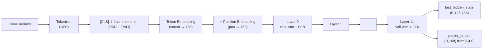

**Tokenization (BPE — Byte-Pair Encoding)**:
RoBERTa uses a 50,265-word vocabulary built from subword units. The sentence `"I love memes"` becomes tokens: `[CLS]`, `I`, `Ġlove`, `Ġmeme`, `s`. The `Ġ` prefix denotes a space-preceded token. [CLS] is a special token prepended to every sequence — it will serve as the "aggregate representation" of the entire sentence.

**Embedding Layer**:
Each token ID maps to a 768-dimensional vector via a lookup table. Additionally, a **position embedding** (encoding token order: 0, 1, 2, ...) is added element-wise so the model knows word order. This gives us `(B, T, 768)`.

**Transformer Layer (×12)**:
Each layer contains two sub-layers:

1. **Multi-Head Self-Attention**: Every token attends to every other token in the same sequence. For token `i`, the layer computes:
   $$\text{Attention}(Q_i, K, V) = \sum_{j} \left(\text{softmax}\left(\frac{Q_i \cdot K_j}{\sqrt{64}}\right) \cdot V_j\right)$$

   This means "how much should token `i` pay attention to token `j`?" — enabling the model to relate *meme* to *love*.

2. **Feed-Forward Network (FFN)**: Two linear transformations with GELU activation:
   $$\text{FFN}(x) = W_2 \cdot \text{GELU}(W_1 \cdot x + b_1) + b_2$$
   where $W_1 \in \mathbb{R}^{768 \times 3072}$, $W_2 \in \mathbb{R}^{3072 \times 768}$.

Each sub-layer is wrapped with **residual connection** + **LayerNorm**: $\text{LayerNorm}(x + \text{Sublayer}(x))$.

**The [CLS] Token**:
After 12 layers of self-attention, the [CLS] token at position 0 has attended to every other token in the sequence. It becomes a **summary vector** of the entire sentence. The `pooler_output` applies an additional `Linear(768→768) + Tanh` to this [CLS] vector — this is what baseline uses.

**How Self-Attention Actually Aggregates into [CLS]**:
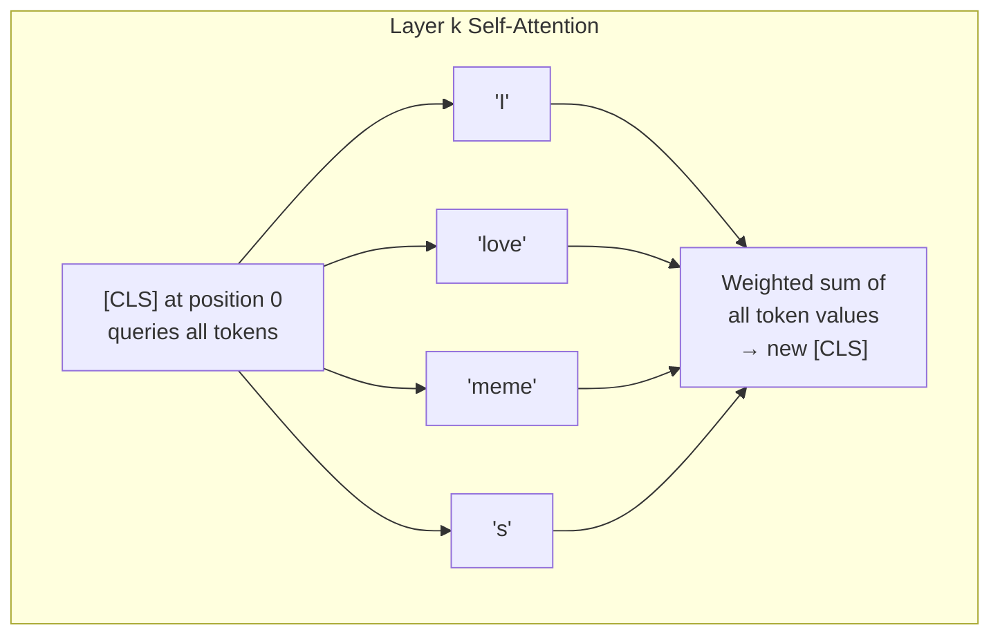

At layer 0, [CLS] sees raw word embeddings. By layer 11, [CLS] has accumulated context from the entire sentence — it "knows" that "love" modifies the sentiment and "memes" is the topic.

---

### 2.6 - Under the Hood: How ViT Works (Image Encoder)

Vision Transformer (ViT-B/16) treats an image as a **sequence of patches**, analogous to how RoBERTa treats text as a sequence of tokens.

**Step-by-step pipeline:**

```mermaid
flowchart LR
    A["Image\n(3,224,224)"] --> B["Split into\n14×14 grid\n(196 patches)"]
    B --> C["Each patch:\n16×16×3 = 768 values"]
    C --> D["Conv Projection\n3→768, kernel=16,\nstride=16"]
    D --> E["Flatten to tokens\n(196,768)"]
    E --> F["Prepend [CLS]\n(197,768)"]
    F --> G["+ Position Embed\n(197,768)"]
    G --> H["Block 0\nSelf-Attn + FFN"]
    H --> I["Block 1"]
    I --> J["..."]
    J --> K["Block 11\nSelf-Attn + FFN"]
    K --> L["197 token vectors\n[CLS] + 196 patches"]
```

**Patch Embedding (conv_proj) — The Key Innovation**:
Instead of convolutions, ViT uses a single `nn.Conv2d(3, 768, kernel_size=16, stride=16)` — this is equivalent to splitting the 224×224 image into a 14×14 grid of non-overlapping 16×16 patches (196 total), then linearly projecting each patch from $16 \times 16 \times 3 = 768$ color values to a 768-dimensional embedding.

Think of each patch as a "visual word" — just like a token in text.

**Position Embedding**:
Since the transformer has no innate sense of spatial layout, a learnable position embedding is added to each of the 197 positions (1 CLS + 196 patches). This lets the model know that "patch (0,0) is top-left" and "patch (13,13) is bottom-right".

**Transformer Block (×12)**:
Identical in structure to RoBERTa's blocks: Multi-Head Self-Attention + MLP, each with residual + LayerNorm. The key difference is that ViT was pretrained on **ImageNet-21k** (14M images) by treating the [CLS] token as the "image class predictor".

After 12 blocks, the [CLS] token has attended to all 196 patches and aggregated a global understanding: *"this is a face in the center, with dark background, text overlay at top"*.

**Why 196 Patches?**
- Input: $224 \times 224$
- Patch size: $16 \times 16$
- Grid: $224/16 = 14$ per side → $14 \times 14 = 196$ patches
- With [CLS]: 197 tokens × 768 dims

---

### 2.7 - Under the Hood: How Freezing Works (Gradient Flow & Backprop)

When you call `param.requires_grad = False`, PyTorch treats that parameter as a **constant** during the backward pass — gradients are never computed or stored for it.

**The Backpropagation Path**:

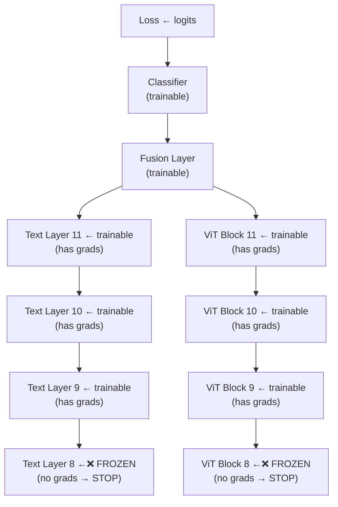

Gradients flow backward from the loss. At each frozen layer boundary, the chain rule **stops** — no gradient information propagates further. This means:
- **Bottom 8 layers never change** — their weights are locked at pretrained values
- **Top 4 layers adapt** — their weights shift to the hateful-meme domain
- **Fusion layers learn from scratch** — they are randomly initialized and fully trained

**Why This Prevents Catastrophic Forgetting**:
If you fine-tuned all 12 layers on a small meme dataset, the model would "forget" general language/vision knowledge learned from massive pretraining datasets. The bottom layers encode fundamental patterns (subject-verb agreement, edge detection) that transfer universally — freezing them preserves this knowledge while the top layers specialize.

**Memory Efficiency**:
`requires_grad=False` also saves VRAM — PyTorch doesn't allocate gradient buffers for frozen parameters. For ~211M total parameters with ~150M frozen, this saves roughly 150M × 4 bytes = 600MB of gradient memory.

---

### 2.8 - Under the Hood: Why Project to 512? (Joint Projection Space)

Models 2-4 use `nn.Linear(768, 512)` to project both modalities into a shared space before fusion. Baseline skips this (raw 768-dim concatenation).

**Why not just use the raw 768-dimensional vectors directly?**

1. **Modality Gap**: RoBERTa's 768-dim space and ViT's 768-dim space are *different mathematical spaces*. RoBERTa's dim 0 might encode "sentiment polarity" while ViT's dim 0 might encode "red color intensity". Comparing or attention between them directly would be comparing apples to oranges.

2. **Dimensionality Reduction (Bottleneck)**: 512 acts as a **learnable information bottleneck**. The projection layer is forced to extract only the most relevant 512 features from each modality — features useful for *cross-modal alignment*. This is a form of implicit regularization.

3. **Multi-Head Compatibility**: For cross-attention with 8 heads, $d_{model}=512$ gives $d_k = 512/8 = 64$ per head — a clean integer division. If we used 768, $768/8=96$ which is valid but less standard.

4. **Parameter Efficiency**: A 768→512 projection has $768 \times 512 + 512 = 393,728$ parameters. A 768→768 projection would have $768 \times 768 + 768 = 590,592$. The bottleneck saves ~33% parameters per projection.

**What the projection actually learns**:
Think of `nn.Linear(768, 512)` as a **learned translator**. During training, the linear layer's weight matrix $W \in \mathbb{R}^{512 \times 768}$ learns which combinations of the 768 original features matter for cross-modal alignment. After training, dimension 0 of the projected space might consistently encode "is this about a person?" for both text and image inputs.

---

## 3. Model 1: Baseline Fusion (`baseline_fusion.ipynb`)

### 3.1 Architecture (Mermaid)

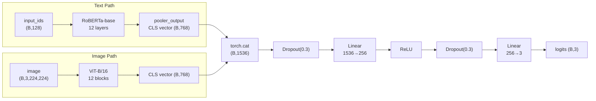

**Fusion type**: Late Fusion — zero cross-modal interaction. Text and image are independently encoded; only the final classifier sees both.

### 3.2 Forward Pass (Tensor Shapes)

```
input_ids:         (B, 128)          # tokenized text
attention_mask:    (B, 128)
image:             (B, 3, 224, 224)

text_features:     (B, 768)          # RoBERTa pooler_output [CLS]
image_features:    (B, 768)          # ViT head output (with head=Identity)

fused:             (B, 1536)         # torch.cat([text, image], dim=1)
logits:            (B, 3)            # MLP output
```

### 3.3 Mathematical Formulation

$$h = [\text{RoBERTa}_{\text{CLS}}(T) \parallel \text{ViT}_{\text{CLS}}(I)] \in \mathbb{R}^{1536}$$
$$\hat{y} = \text{softmax}(W_2 \cdot \text{ReLU}(W_1 \cdot h + b_1) + b_2)$$

where $\parallel$ denotes concatenation. No learnable parameters exist between the two modalities — they are independently encoded and fused only at the classifier level.

### 3.4 Code Quality Assessment

**Strengths**:
- Minimal, clean — only 78 lines for the model class
- Freezing helpers are well-structured (`_freeze_roberta_layers`, `_freeze_vit_blocks`)
- Explicit dimension tracking (`text_dim`, `image_dim`, `fused_dim`, `hidden_dim`)
- Uses `pooler_output` — the simplest RoBERTa representation

**Potential issues**:
- `vit_b_16` import uses deprecated `pretrained=True` — should be `weights=ViT_B_16_Weights.IMAGENET1K_V1` in newer `torchvision`
- Sets `image_encoder.heads = nn.Identity()` but some ViT versions use `.head` (singular) — version-dependent
- No residual connection in the MLP — could benefit from LayerNorm before classifier
- No dropout before concatenation — raw CLS tokens may have different activation scales

---

### 3.5 - Under the Hood: CLS Token — How One Vector Summarizes an Entire Sequence

The [CLS] (Classification) token is a special token prepended to every input sequence. After passing through 12 layers of **self-attention**, this single 768-dimensional vector encodes a summary of the entire input.

**How Self-Attention Builds the CLS Representation**:

At each transformer layer, the [CLS] token **queries** every other token:

```
Layer 0: [CLS]₀ = "I see tokens: I, love, memes"
Layer 1: [CLS]₁ = "The token 'love' seems to carry positive sentiment"
Layer 3: [CLS]₃ = "'memes' is the subject, 'love' is the sentiment, overall positive"
Layer 11: [CLS]₁₁ = "This is a positive statement about internet memes"
```

At each layer, the CLS token performs:
$$\text{CLS}_{\text{new}} = \text{LayerNorm}\left(\text{CLS}_{\text{old}} + \sum_{j} \alpha_j \cdot V_j\right)$$

where $\alpha_j$ is the attention weight from [CLS] to token $j$, learned dynamically per input. This means:
- If the sentence is *"I hate this"*, [CLS] will weight "hate" highly
- If the sentence is *"beautiful sunset over mountains"*, [CLS] will distribute attention across "beautiful", "sunset", "mountains"

**Same Process for ViT [CLS]**:
The image [CLS] token attends to all 196 patches. After 12 blocks, it encodes: *"there's a face in the center, dark background, person appears angry"*.

**Why [CLS] Works for Classification**:
BERT/RoBERTa was pretrained with a "Next Sentence Prediction" task where [CLS] had to determine if two sentences were related. This forced [CLS] to become a good sequence-level summary. ViT was pretrained on ImageNet classification — similarly forcing its [CLS] to aggregate image-level information.

---

### 3.6 - Under the Hood: Late Fusion Intuition — What It Can and Cannot Capture

**What Late Fusion CAN capture**:

| Scenario | Text says | Image shows | Late fusion can detect? |
|----------|-----------|-------------|------------------------|
| Direct hate | "I hate you" | Angry face | Yes — both signals independently suggest hate |
| Obvious mismatch | "Beautiful day" | Explosion | Yes — MLP can learn that positive text + violent image = suspicious |
| Text-only hate | "Kill all X" | Neutral photo | Yes — text signal alone is strong |

**What Late Fusion CANNOT capture**:

| Scenario | Why it fails | Fix needed |
|----------|-------------|------------|
| *"Nice haircut, loser"* pointing at someone | The word "nice" + haircut image region = sarcasm. Late fusion only sees global averages | Needs word-to-region alignment |
| Meme text is ON the image | Text literally spatially interacts with image regions — a word is placed over a face | Needs spatial reasoning |
| *"Not this guy again"* with photo of politician | You need to link "this guy" → the face in the image. Late fusion treats them independently | Needs cross-modal attention |

**The Mathematical Limitation**:
$$h = [f_{\text{text}}(T) \parallel f_{\text{image}}(I)]$$

The functions $f_{\text{text}}$ and $f_{\text{image}}$ never share information. The MLP classifier sees a 1536-dimensional vector but has no way to say "dimension 245 of text should be compared with dimension 89 of image." This is why we need cross-modal mechanisms.

---

## 4. Model 2: Co-Attention Fusion (`co_attention.ipynb`)

### 4.1 Architecture (Mermaid)

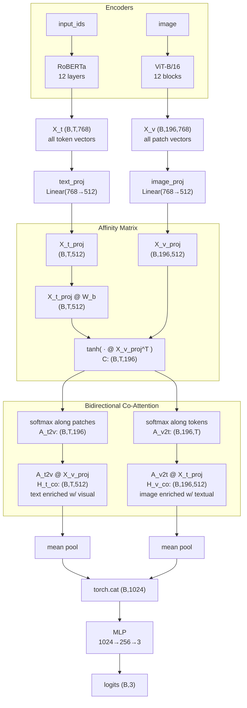

### 4.2 Forward Pass (Tensor Shapes)

```
X_t:               (B, T, 768)       # RoBERTa last_hidden_state, T ≤ 128
X_v:               (B, 196, 768)     # ViT patch tokens (excl. CLS)

X_t_proj:          (B, T, 512)       # text_seq → joint space
X_v_proj:          (B, 196, 512)     # image patches → joint space
W_b:               (512, 512)        # bilinear affinity weight

C:                 (B, T, 196)       # affinity matrix, C[i,j] = sim(text_token_i, patch_j)

A_t2v:             (B, T, 196)       # softmax over patches  (dim=-1)
H_t_co:            (B, T, 512)       # text enriched with visual context

A_v2t:             (B, 196, T)       # softmax over tokens   (dim=-1)
H_v_co:            (B, 196, 512)     # image enriched with textual context

t_pooled + v_pooled: (B, 512) each  → concat → (B, 1024)
logits:            (B, 3)
```

### 4.3 Mathematical Formulation

**Affinity matrix** (bilinear form):
$$C_{ij} = \tanh\left( (X_t^\text{proj} W_b) \cdot (X_v^\text{proj})^T \right)_{ij}$$

This measures the similarity between text token $i$ and image patch $j$ in the projected joint space. The bilinear weight $W_b \in \mathbb{R}^{512 \times 512}$ learns cross-modal interaction patterns.

**Bidirectional attention**:
$$H_t^\text{co} = \text{softmax}_{\text{patches}}(C) \cdot X_v^\text{proj} \quad \in \mathbb{R}^{B \times T \times 512}$$
$$H_v^\text{co} = \text{softmax}_{\text{tokens}}(C^T) \cdot X_t^\text{proj} \quad \in \mathbb{R}^{B \times 196 \times 512}$$

**Fusion**: Both co-attended sequences are mean-pooled and concatenated:
$$h_f = [\text{mean}(H_t^\text{co}) \parallel \text{mean}(H_v^\text{co})] \in \mathbb{R}^{1024}$$

### 4.4 Code Quality Assessment

**Strengths**:
- Clean separation of concerns: `encode_image_patches` method isolates ViT forward logic
- Proper reuse of `vit_conv_proj`, `vit_class_token`, `vit_encoder` from pretrained ViT
- `W_b` parameter initialized with small random values (`* 0.02`) — good practice for bilinear attention
- `torch.tanh` bounds affinity to [-1, 1] — prevents exploding attention weights

**Potential issues**:
- `attention_mask` from text is **not applied** during co-attention — padded text tokens can attend to image patches (and vice versa), injecting noise. Should mask softmax with `~attention_mask.bool()`
- `encode_image_patches` **discards the CLS token** (`x[:, 1:, :]`) — intentional but means global image context is lost
- The bilinear form $X_t W_b X_v^T$ requires $T \times 196$ memory per sample; at T=128 this is 25K entries — manageable but scales quadratically
- No residual connection after co-attention — unlike cross_attetion which has residual + LayerNorm
- Mean pooling treats all tokens equally — a learned pooling (attention or weighted sum) could be more expressive

---

### 4.5 - Under the Hood: Affinity Matrix Walkthrough (Concrete Example)

The affinity matrix $C$ is the heart of co-attention. It answers: *"How relevant is each word to each image region?"*

**Concrete example**: Text = "angry face", Image = a 2×2 grid (4 patches) for simplicity.

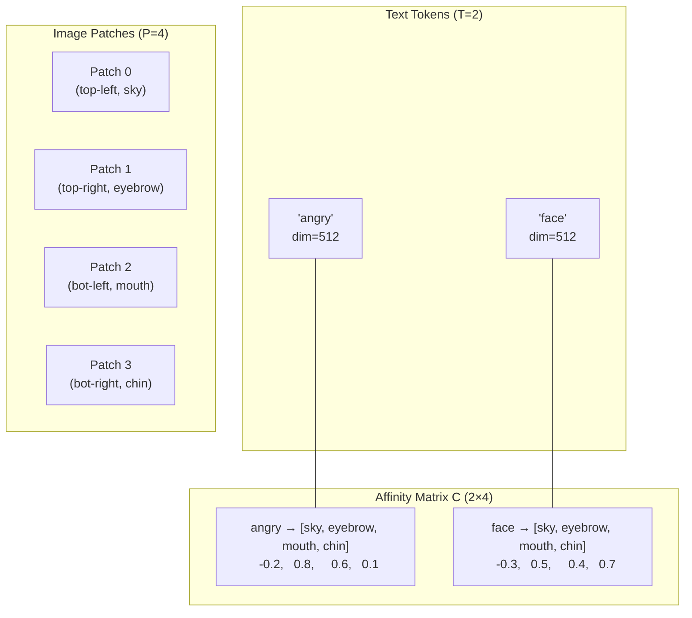

**How to read C**:
- $C_{0,1} = 0.8$: "angry" has high affinity with the eyebrow patch (makes sense — angry eyebrows!)
- $C_{0,2} = 0.6$: "angry" also relates to the mouth (scowling)
- $C_{0,0} = -0.2$: "angry" has low (negative) affinity with the sky background
- $C_{1,3} = 0.7$: "face" relates to the chin patch

**After softmax along patches (A_t2v)**:
Each row becomes a probability distribution over patches:
```
angry → [0.02, 0.55, 0.38, 0.05]   # 55% attention to eyebrow!
face  → [0.02, 0.20, 0.18, 0.60]   # 60% attention to chin!
```

**After softmax along tokens (A_v2t)**:
Each column becomes a probability distribution over tokens:
```
       angry  face
sky     0.48  0.52   # slightly more "face"
eyebrow 0.72  0.28   # strongly "angry"!
mouth   0.68  0.32   # mostly "angry"
chin    0.15  0.85   # strongly "face"
```

**What H_t_co contains** (text enriched with visual):
For the token "angry", $H_t^\text{co}$["angry"] = $0.55 \cdot V_{\text{eyebrow}} + 0.38 \cdot V_{\text{mouth}} + 0.05 \cdot V_{\text{chin}} + 0.02 \cdot V_{\text{sky}}$. The "angry" vector is now injected with information from the eyebrow and mouth patches.

---

### 4.6 - Under the Hood: The Bilinear Form — Why $X_t W_b X_v^T$, Not Just $X_t X_v^T$

A **simple dot product** ($X_t X_v^T$) measures raw cosine similarity in the projected space. But text and image vectors, even after projection to 512 dimensions, may encode concepts in **incompatible subspace layouts**.

**The Problem with Raw Dot Products**:

```
Text proj space:       Image proj space:
dim 0 = sentiment       dim 0 = brightness
dim 1 = noun_type       dim 1 = texture
dim 2 = person_name     dim 2 = position_y
...
```

With raw $X_t X_v^T$, dimension 0 of text is compared to dimension 0 of image — but they encode different concepts! "Sentiment" vs "brightness" has no meaningful relationship.

**What $W_b$ Does — A Learned Cross-Modal Mapping**:
$$C_{ij} = \tanh\left( \sum_{a=1}^{512} \sum_{b=1}^{512} (X_t^\text{proj})_{i,a} \cdot (W_b)_{a,b} \cdot (X_v^\text{proj})_{j,b} \right)$$

The matrix $W_b \in \mathbb{R}^{512 \times 512}$ learns **which dimensions should interact across modalities**. After training:

- $W_b[0, 5] = 0.8$ → "text sentiment dim 0 relates to image expression dim 5" (angry text ↔ angry face)
- $W_b[1, 2] = 0.1$ → "text noun_type dim 1 weakly relates to image position dim 2" (irrelevant)
- $W_b[50, 50] = -0.3$ → "text emotion dim 50 anti-correlates with image color dim 50"

**The $W_b$ Parameter Init**: `torch.randn(512, 512) * 0.02` — initialized with small random values. Starting from near-zero means the model begins with weak cross-modal interaction (similar to late fusion) and gradually learns meaningful cross-modal patterns.

---

### 4.7 - Under the Hood: Tanh and Softmax — The Activation Pipeline

The co-attention code uses two activation functions in sequence:

**Step 1: Tanh — Bounding the Affinity**

```python
C = torch.tanh(X_t_w @ X_v_proj.transpose(-2, -1))
```

`tanh(x)` squashes any real number to $[-1, 1]$:

```
  x: -100  -2   -1   0   0.5   2   100
tanh: -1.0  -0.96 -0.76  0  0.46  0.96  1.0
```

**Why tanh?** Without it, a single extremely high-affinity pair (e.g., "face" ↔ face_patch = 50) would make softmax collapse to one-hot — all attention goes to one patch, ignoring everything else. Tanh bounds the range, keeping attention **distributed**.

**Step 2: Softmax — Two Different Directions**

```python
A_t2v = torch.softmax(C, dim=-1)      # over patches (columns)
A_v2t = torch.softmax(C.transpose(-2, -1), dim=-1)  # over tokens (rows)
```

**`softmax(C, dim=-1)` — Text attends over Image**:
For each text token (row), normalize across all 196 patches:

```
Before softmax:  "angry" → [ -0.2,  0.8,  0.6,  0.1]
After softmax:   "angry" → [ 0.02, 0.55, 0.38, 0.05]
                                       ↑
                              sum always = 1.0
```

Each text token **selectively focuses** on the most relevant image regions.

**`softmax(C^T, dim=-1)` — Image attends over Text**:
For each image patch (column), normalize across all text tokens:

```
Before softmax:  eyebrow → [ 0.8 (angry),  0.5 (face)]
After softmax:   eyebrow → [ 0.72, 0.28]
                              ↑
                       sum always = 1.0
```

Each image patch **knows which words describe it**.

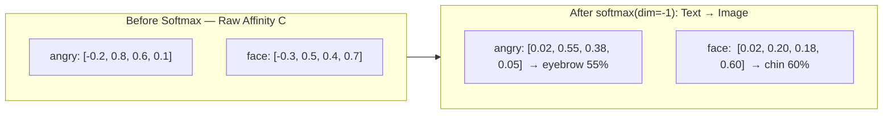

---

### 4.8 - Under the Hood: Co-Attention Intuition — The Two Translators Analogy

Imagine two translators — one fluent in "Text" and one fluent in "Image" — trying to understand a meme together:

```
Translator A (Text):  "The sentence says 'worst day ever'"
Translator B (Image): "The photo shows someone crying in rain"

Without co-attention: Each writes their report independently.
    A: "Negative sentiment detected."
    B: "Sad scene detected."
    → The MLP gets two independent reports and tries to guess.

WITH co-attention:
    A asks B: "Which part of the image relates to 'worst'?"
    B responds: "The crying face (patch 45) and rain (patches 60-80)"
    A updates: "'worst' now includes crying + rain information"

    B asks A: "Which words describe the rain?"
    A responds: "'worst' and 'day'"
    B updates: "Rain patches now include negative sentiment"

    → The MLP gets reports that already "understand" each other.
```

**Why Bidirectionality Matters**:
- Text → Image: The word "worst" finds and reinforces the crying face. Without this, "worst" is just a generic negative word.
- Image → Text: The rain patches find and reinforce "day" + "worst." Without this, rain is just a weather pattern.

The **bidirectional exchange** means both modalities enrich each other before the classifier sees them.

---

## 5. Model 3: Cross-Attention Fusion (`cross_attetion.ipynb`)

### 5.1 Architecture (Mermaid)

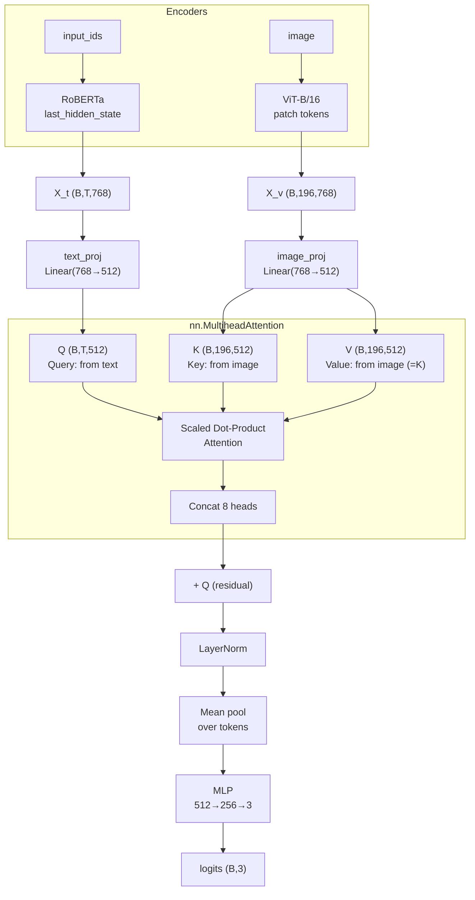

### 5.2 Forward Pass (Tensor Shapes)

```
X_t:               (B, T, 768)
X_v:               (B, 196, 768)

Q (Query):         (B, T, 512)        # from text tokens
K (Key):           (B, 196, 512)      # from image patches
V (Value):         (B, 196, 512)      # same as K

attn_out:          (B, T, 512)        # cross-attention output
+ Q:               (B, T, 512)        # residual connection
→ LayerNorm →      (B, T, 512)        # post-norm

pooled:            (B, 512)           # mean over text tokens
logits:            (B, 3)
```

### 5.3 Mathematical Formulation

Standard multi-head cross-attention with **text as query** and **image as key/value**:

$$\text{head}_h = \text{softmax}\left(\frac{Q W_h^Q \cdot (K W_h^K)^T}{\sqrt{d_k}}\right) \cdot V W_h^V$$

$$\text{CrossAttn}(Q,K,V) = [\text{head}_1 \parallel \dots \parallel \text{head}_8] W^O$$

With residual connection and post-LayerNorm:
$$H^\text{cross} = \text{LayerNorm}(\text{CrossAttn}(Q,K,V) + Q)$$

**Design choice**: V = K means image patches serve as both the attention keys and the information source. Text tokens query which image regions are relevant, and the output is a visual-context-aware text representation.

### 5.4 Code Quality Assessment

**Strengths**:
- Uses PyTorch's `nn.MultiheadAttention` with `batch_first=True` — concise, tested implementation
- Residual + LayerNorm follows Transformer best practices
- `num_heads=8` with `embed_dim=512` gives $d_k = 64$ per head — standard and well-justified
- Simplest dimension path: `512 → 512 → 256 → 3` — no unnecessary intermediate projections
- `attention_mask` from text could be passed to MHA's `key_padding_mask` for proper masking

**Potential issues**:
- **Typo in filename**: `cross_attetion.ipynb` (missing 'n' in "attention") — cosmetic but confusing
- `attention_mask` is again **unused** during cross-attention — padded tokens can attend to image patches
- Image patch attention mask is **not created** — ViT has a fixed 196 patches so no padding, but text has variable length padding that should be masked
- **One-way**: only text attends to image, image never gets enriched by text — limits bidirectionality
- `Value = Key` means the attention output is a weighted sum of projected image patches — the `V` linear projection is shared with `K`, losing one degree of freedom in the projection

---

### 5.5 - Under the Hood: Q, K, V — The Library Analogy

The Query-Key-Value mechanism is the core of all attention. The best intuition is a **library search**:

```
You walk into a library looking for books about "angry facial expressions."

QUERY (Q): "angry facial expressions"           ← your search terms (from text)
KEY (K):   Book titles on the shelves           ← what each book is about (from image)
VALUE (V): The actual book content              ← the full information (from image)

Step 1: Compare Q with every K → relevance scores
        "Anger in Modern Art"      → 0.9 (high match!)
        "Happy Puppies Calendar"   → 0.1 (low match)
        "Psychology of Emotion"    → 0.7
        "Underwater Photography"   → 0.0

Step 2: Weight the Values by these scores
        Output = 0.9 × V_art + 0.1 × V_puppies + 0.7 × V_psych + 0.0 × V_water
               = mostly art + psychology information, ignoring irrelevant books

Step 3: You walk out with a summary that's heavily informed by the matching books.
```

**In our cross-attention**:
- **Q** (Query): Each text token asks *"which image regions are relevant to me?"*
- **K** (Key): Each image patch advertises *"this is what kind of visual feature I contain"*
- **V** (Value): Each image patch provides *"here is my actual content"*

The specific math:
$$\text{Attention}(Q, K, V) = \text{softmax}\left(\frac{QK^T}{\sqrt{64}}\right) V$$

- $QK^T$: (B, T, 512) × (B, 512, 196) → (B, T, 196) — similarity between every text token and image patch
- $\text{softmax}$: Converts similarities to a probability distribution over patches
- $\times V$: Weighted sum of patch information → the output for each text token now contains visual context

**Why V = K in this implementation**:
```python
K = self.image_proj(X_v)    # (B, P, 512)
V = K                        # (B, P, 512) — shared projection
```

This means the same projection serves as both the "lookup key" and the "content source." This is a simplification — in the original Transformer, Q, K, V each have separate projections ($W^Q, W^K, W^V$). Here, using the same projection for K and V saves parameters but means the model can't learn separate "matching" and "content" representations.

---

### 5.6 - Under the Hood: Multi-Head Attention — 8 Parallel "Viewpoints"

A single attention head can only learn **one type of relationship**. Multiple heads learn **different types simultaneously**.

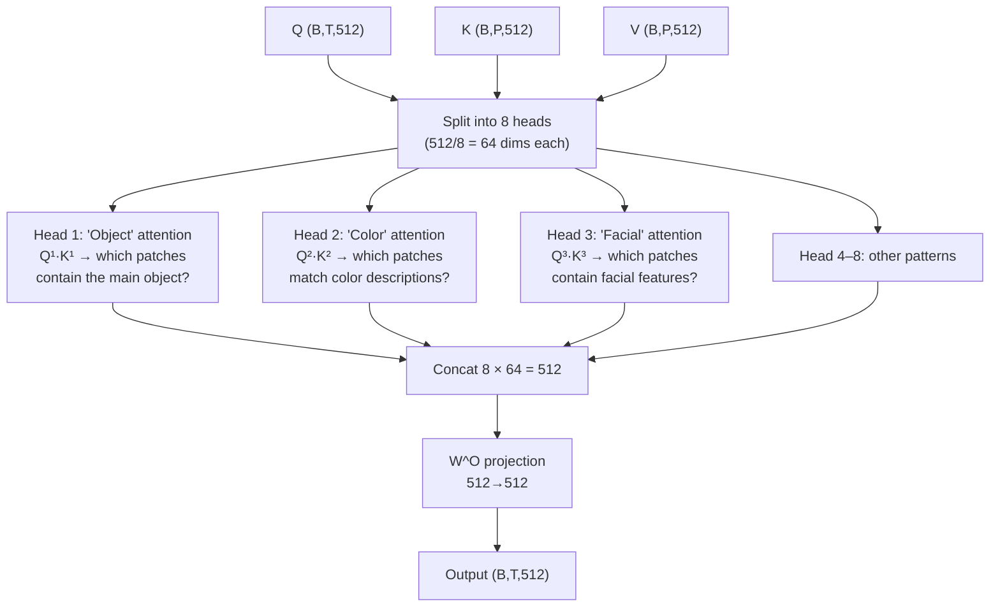

**Per-head dimensions**: Each head works in a 64-dimensional subspace:
$$d_k = \frac{d_{model}}{h} = \frac{512}{8} = 64$$

**What each head learns** (hypothetical after training on hateful memes):

| Head | Might Specialize In | Example |
|------|-------------------|---------|
| 1 | Person/face detection | "ugly" → face region |
| 2 | Text overlay detection | "nobody:" → meme text in image |
| 3 | Emotion matching | "crying" → tear region |
| 4 | Object matching | "money" → dollar sign in image |
| 5 | Gesture reading | "thumbs up" → hand gesture region |
| 6 | Spatial relations | "behind him" → background patches |
| 7 | Context/scene | "in the office" → desk, chair patches |
| 8 | Hate symbol detection | swastika → red circle with symbol |

**The $\sqrt{d_k}$ Scaling Factor**:
$$\text{Attention} = \text{softmax}\left(\frac{QK^T}{\sqrt{64}}\right) V$$

Without $\sqrt{64} = 8$ divisor, the dot products $Q_i \cdot K_j$ would have variance 64 (sum of 64 independent products). Large dot products before softmax → near-one-hot attention → vanishing gradients. Dividing by $\sqrt{d_k}$ keeps the variance at 1.

---

### 5.7 - Under the Hood: Residual Connection + LayerNorm — Why They Matter

```python
attn_out, _ = self.cross_attn(Q, K, V)  # (B, T, 512)
attn_out = self.layer_norm(attn_out + Q) # residual + norm
```

**Residual Connection (`attn_out + Q`)**:

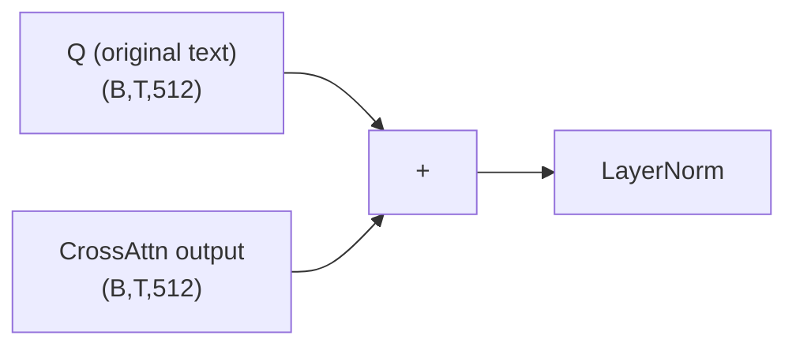

The residual connection creates a **"skip path"** — the original text representation flows directly to the output, with the cross-attention output added as a **modification** (not a replacement). This is crucial because:

1. **Preserves original meaning**: If cross-attention produces garbage (e.g., all patches are irrelevant), the model can fall back to the original text representation. Without residual: the model *must* use the cross-attention output, even if it's wrong.

2. **Gradient highway**: During backpropagation, gradients flow through both paths — through the attention layer AND directly through the skip connection. This prevents vanishing gradients in deep networks.

3. **Learning residual**: The attention layer only needs to learn the *difference* from the original. It's easier to learn "add a small visual adjustment" than "completely reconstruct the representation."

**LayerNorm**:
$$\text{LayerNorm}(x) = \gamma \cdot \frac{x - \mu}{\sigma} + \beta$$

where $\mu, \sigma$ are computed across the feature dimension (512), and $\gamma, \beta$ are learnable parameters.

LayerNorm normalizes each token's representation to mean=0, std=1 (then rescales with learnable parameters). This:
- Stabilizes training by preventing activation values from growing too large
- Makes the model less sensitive to the scale of inputs
- Allows the residual sum to work — without normalization, the summed values could drift to extreme ranges

---

## 6. Model 4: Hierarchical Cross-Attention (`hierarchical_cross_attention.ipynb`)

### 6.1 Architecture (Mermaid)

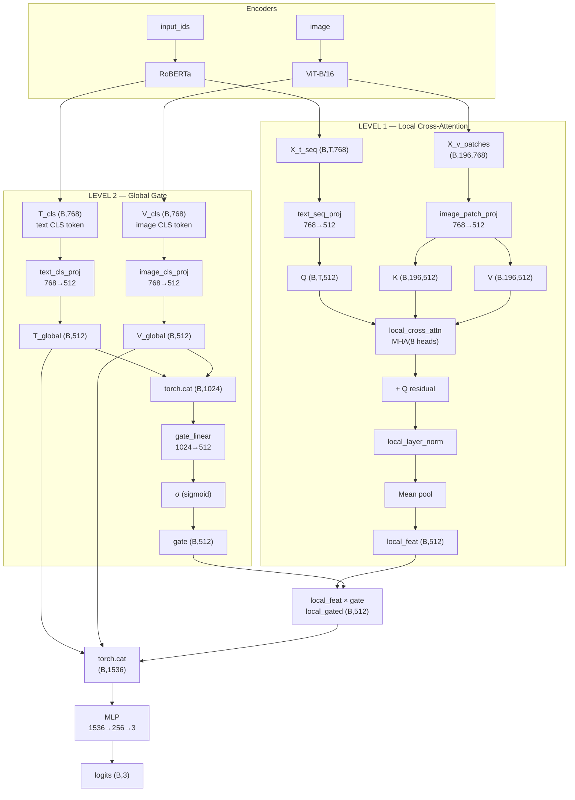

### 6.2 Forward Pass (Tensor Shapes)

```
# Unimodal encodings
X_t_seq:           (B, T, 768)       # full text sequence
T_cls:             (B, 768)          # text [CLS] token
V_cls:             (B, 768)          # image [CLS] token
X_v_patches:       (B, 196, 768)     # image patch tokens

# LEVEL 1 — Local Cross-Attention
Q:                 (B, T, 512)       # text tokens → query
K, V:              (B, 196, 512)     # image patches → key/value
local_out:         (B, T, 512)       # MHA output
  + Q residual:    (B, T, 512)
  → LayerNorm:     (B, T, 512)
  → mean pool:     (B, 512)          # local_feat

# LEVEL 2 — Global Gate
T_global:          (B, 512)          # projected text CLS
V_global:          (B, 512)          # projected image CLS
gate_input:        (B, 1024)         # concat[T_global, V_global]
gate:              (B, 512)          # σ(Linear(gate_input))
local_gated:       (B, 512)          # gate * local_feat

# Final Fusion
fused:             (B, 1536)         # [T_global; V_global; local_gated]
logits:            (B, 3)
```

### 6.3 Mathematical Formulation

**Level 1 — Local Cross-Attention**:
Identical to Model 3 (cross-attention), producing per-text-token representations enriched with relevant image patch information. Mean-pooled to a single vector:

$$\text{local\_feat} = \frac{1}{T} \sum_{i=1}^{T} \text{CrossAttn}(Q_i, K, V) \in \mathbb{R}^{512}$$

**Level 2 — Global Gate**:
$$g = \sigma(W_g \cdot [T_{\text{CLS}}^\text{proj} \parallel V_{\text{CLS}}^\text{proj}] + b_g) \in \mathbb{R}^{512}$$

$$\text{local\_gated} = \text{local\_feat} \odot g \quad \text{(element-wise)}$$

The gate $g$ modulates the local cross-attention signal: when global CLS tokens indicate strong alignment, the gate opens; when they disagree, the gate suppresses local features.

**Final fusion**:
$$h_f = [T_{\text{CLS}}^\text{proj} \parallel V_{\text{CLS}}^\text{proj} \parallel \text{local\_gated}] \in \mathbb{R}^{1536}$$

### 6.4 Code Quality Assessment

**Strengths**:
- Most sophisticated architecture — uniquely combines local and global signals
- **Gate mechanism** is learnable and data-driven — the model decides how much local cross-attention to trust
- Four separate projections (`text_seq_proj`, `image_patch_proj`, `text_cls_proj`, `image_cls_proj`) give maximum flexibility
- **Preserves CLS tokens** — unlike co_attention and cross_attetion which discard them
- Good naming conventions: `local_cross_attn`, `local_layer_norm`, `gate_linear`, `local_gated`

**Potential issues**:
- `attention_mask` unused — same issue as all other models
- **Four projection layers** have identical input/output dimensions (768→512) — could be consolidated into fewer layers to reduce parameter count
- Gate uses `sigmoid` → [0,1] per element — this is a **fine-grained** gate (each of 512 dims is independently gated). A scalar gate (`sigmoid(Linear(1024→1))`) would be simpler but less expressive
- **No learnable interaction** between T_global and V_global beyond concatenation in the gate — could add a simple dot-product or bilinear term
- Three separate inputs to final classifier may have different scales — a LayerNorm before the MLP could help stabilize training

---

### 6.5 - Under the Hood: Two-Level Design Rationale — Why Local + Global?

The hierarchical design mirrors how humans process multimodal information. Consider a sarcastic meme:

```
Image: A person smiling while holding a burning house
Text:  "Living my best life "
```

**Level 1 (Local) — Word-to-Region Alignment**:
The cross-attention finds fine-grained connections:
- "best" → the smiling face (makes sense in isolation)
- "life" → the house (makes sense in isolation)
- Cross-attention output says: *"words match their visual referents"*

But this is **wrong** — the house is burning! The local view is fooled by the sarcasm because it only sees word-level alignments without understanding the **global contradiction**.

**Level 2 (Global) — Holistic Contradiction Detection**:
The CLS tokens encode the **overall** meaning:
- Text CLS: *"Overall: positive, cheerful statement"*
- Image CLS: *"Overall: disaster scene, destruction"*
- Gate computation: $g = \sigma(W_g \cdot [T_{\text{CLS}} \parallel V_{\text{CLS}}])$

The gate learns that when text CLS = positive AND image CLS = disaster:
$$\text{gate} \rightarrow [0.05, 0.02, 0.10, ...] \quad \text{(mostly closed)}$$

This **suppresses** the local cross-attention output — the model learns: *"local alignments are misleading when there's a global contradiction."*

**What happens for non-sarcastic memes?**
```
Image: A person genuinely smiling at a beautiful sunset
Text:  "What a beautiful evening "
```
- Text CLS: positive, genuine
- Image CLS: positive, peaceful
- Gate: mostly open → $\text{gate} \rightarrow [0.85, 0.92, 0.78, ...]$
- Local cross-attention flows through strongly — word-to-region alignment is trusted

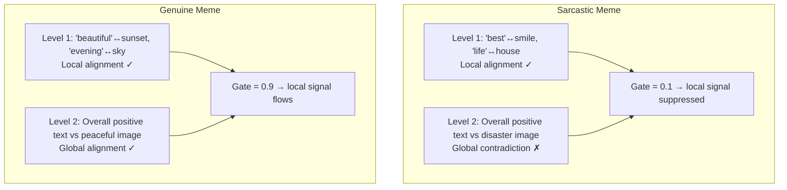

---

### 6.6 - Under the Hood: Gate Mechanism Deep Dive — Element-wise Sigmoid

The gate uses **element-wise sigmoid**, producing 512 independent values in [0,1]:

```python
gate = torch.sigmoid(self.gate_linear(torch.cat([T_global, V_global], dim=-1)))
local_gated = local_feat * gate  # element-wise multiplication
```

**What each of the 512 gate dimensions means**:

After training, each of the 512 dimensions learns to gate a different **semantic feature** of the local cross-attention output:

| Gate Dim | Might Control | When Open (≈1) | When Closed (≈0) |
|----------|--------------|-----------------|-------------------|
| 0 | Sentiment features | Text & image sentiment match | Sarcasm detected |
| 15 | Person identity | Person in text matches person in image | Different people |
| 42 | Emotion intensity | Emotions are consistent | Text says "happy", image shows "crying" |
| 100 | Spatial relations | "behind", "on top" match image layout | Spatial contradiction |
| 200 | Object presence | Named object is visible | Object is absent from image |
| 350 | Text overlay | Meme text matches image text | No text in image |

**Why element-wise (not scalar)?**

A **scalar gate** (`sigmoid(Linear(1024→1))`) produces one number for the entire 512-dim vector — it's an "all or nothing" gate:

```python
# Scalar gate:
gate = sigmoid(linear([T_global; V_global]))  # single value 0.7
local_gated = local_feat * 0.7  # EVERY feature scaled equally
```

The **element-wise gate** (`sigmoid(Linear(1024→512))`) produces a **per-feature** gate:

```python
# Element-wise gate:
gate = sigmoid(linear([T_global; V_global]))  # (B, 512) values
# gate = [0.9, 0.1, 0.8, 0.95, 0.05, 0.7, ...]
local_gated = local_feat * gate  # each feature scaled differently
```

This is more expressive — if sarcasm only affects "sentiment features" (dims 0-50), those dimensions can be gated down while "object identification features" (dims 200-300) remain open because objects are still correctly identified.

---

### 6.7 - Under the Hood: Three-Stream Fusion — Why These Three?

The final fusion concatenates three distinct information streams:

```python
fused = torch.cat([T_global, V_global, local_gated], dim=-1)  # (B, 1536)
```

| Stream | Shape | What It Encodes | When It's Most Useful |
|--------|-------|-----------------|----------------------|
| **T_global** | (B, 512) | Overall text meaning, sentiment, topic | Text-only hate, text that contradicts image |
| **V_global** | (B, 512) | Overall image scene, main object, mood | Image-only hate, violent/offensive imagery |
| **local_gated** | (B, 512) | Word-to-region alignment, gated by global coherence | Subtle multimodal cues (sarcasm, irony) |

**Why not merge earlier?**

If we simply added or concatenated T_global + V_global + local_feat earlier (before gating), we would lose the ability to independently control each stream:

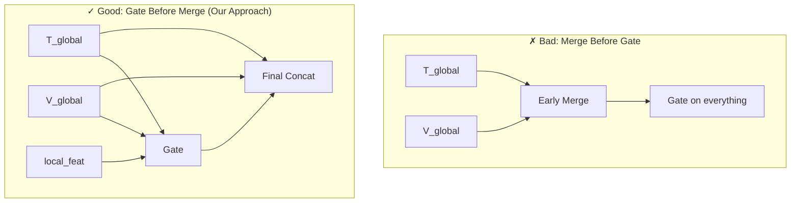

The three-stream approach also gives the MLP classifier **maximum flexibility** — it can learn:
- Weight $W[:, 0:512]$ extracts from text global
- Weight $W[:, 512:1024]$ extracts from image global
- Weight $W[:, 1024:1536]$ extracts from gated local

These are independently learned, so the model can decide per-feature which stream to trust.

---

## 7. Comparative Analysis

### 7.1 Cross-Modal Interaction Depth

```
Model              Interaction    Bidirectional?   Granularity
─────────────────────────────────────────────────────────────
Baseline           None           —                —
Cross-Attention    One-way        No (T → V)       Token-to-Patch
Co-Attention       Two-way        Yes (T ↔ V)      Token-to-Patch
Hierarchical       Two-way[*]     Partial           Token-to-Patch + CLS Gate

[*] Hierarchical is one-way at Level 1 (T → V), but Level 2
    re-injects bidirectional CLS information through the gate.
```

### 7.2 Computational Complexity

| Model | Fusion FLOPs (per sample) | Memory Bottleneck |
|-------|--------------------------|-------------------|
| Baseline | $O(1)$ — just concat | Negligible |
| Cross-Attention | $O(T \cdot P \cdot d_{head})$ per head | $T \times P$ attention matrix (128×196=25K) |
| Co-Attention | $O(T \cdot P \cdot d)$ + $O(T \cdot d^2)$ bilinear | $T \times P$ affinity ×2 (bidirectional) |
| Hierarchical | $O(T \cdot P \cdot d_{head})$ + $O(d^2)$ gate | $T \times P$ attention + gate linear |

The **affinity matrix** in co-attention and **attention matrix** in cross-attention/hierarchical are both $T \times P$ (max 128×196), which is **very manageable** (~25K entries). The bilinear form in co-attention adds one extra $d^2$ operation (512² = 262K), making it slightly heavier than pure MHA.

### 7.3 Strengths & Weaknesses Matrix

| Aspect | Baseline | Co-Attention | Cross-Attention | Hierarchical |
|--------|----------|--------------|-----------------|--------------|
| **Simplicity** | ++ | - | = | -- |
| **Cross-modal signal** | -- | ++ | = | ++ |
| **Bidirectional** | -- | ++ | - | = |
| **Global context** | + (CLS) | - (no CLS) | - (no CLS) | ++ |
| **Local alignment** | -- | ++ | + | + |
| **Training speed** | ++ | - | = | - |
| **Parameter efficiency** | + | = | + | - |
| **Interpretability** | -- | ++ (affinity viz) | + (attn weights) | + |
| **Risk of overfitting** | Low | Medium | Medium | Higher |

### 7.4 When to Use Each

- **Baseline**: Quick sanity check. If this performs well, the task may not require cross-modal reasoning.
- **Cross-Attention**: When text is the primary modality and image serves as context (e.g., VQA where you query the image with a question).
- **Co-Attention**: When both modalities are equally important and mutual alignment matters (e.g., image-text matching, grounding).
- **Hierarchical**: When you need both fine-grained alignment (word→region) and global coherence (does the overall image match the overall text?).

---

### 7.5 - Under the Hood: Training Dynamics — Why Complexity Affects Speed & Overfitting

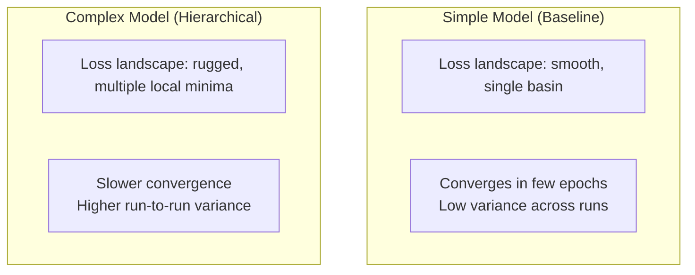

**Why complex models train slower**:
- More parameters → more gradients to compute per step
- The gating mechanism in hierarchical creates a **conditional computation path** — the effective architecture changes per sample, making the loss landscape more complex
- Bilinear forms and attention have **narrower stable learning rate ranges** — too high LR causes attention collapse (all weights → 1/K), too low LR causes slow progress

**Why complex models overfit faster**:
- With 61M trainable parameters on a typically small meme dataset (few thousand samples), the model can memorize training examples instead of learning generalizable patterns
- The gate mechanism can learn dataset-specific artifacts: "in the training set, gate dimension 42 is always 0.8 for class 0" — but this doesn't generalize

**Practical implications**:
| Model | Suggested Epochs | Suggested LR | Regularization |
|-------|-----------------|--------------|----------------|
| Baseline | 5-10 | 2e-5 | Dropout(0.3) |
| Cross-Attention | 8-12 | 2e-5 | Dropout(0.3) + attn_dropout |
| Co-Attention | 8-12 | 1e-5 to 2e-5 | Dropout(0.3) + weight decay |
| Hierarchical | 10-15 | 1e-5 | Dropout(0.4) + weight decay + early stopping |

---

## 8. Cross-Cutting Issues (All Models)

### 8.1 Missing Attention Mask Propagation

**Severity**: Medium-High. All four models receive `attention_mask` but ignore it during fusion.

**Problem**: Padded text tokens (zeros beyond the actual sentence length) participate in attention, injecting meaningless information.

**Fix**: In co-attention and cross-attention, extend the mask to the attention dimensions:

```python
# For co-attention (C shape: B, T, P):
if attention_mask is not None:
    mask_expanded = attention_mask.unsqueeze(-1)  # (B, T, 1)
    C = C.masked_fill(mask_expanded == 0, -1e9)   # before softmax
```

```python
# For cross_attetion MHA:
attn_out, _ = self.cross_attn(Q, K, V, key_padding_mask=(attention_mask == 0))
```

### 8.2 Deprecated `pretrained=True`

**Severity**: Low (warning only). `torchvision` ≥0.14 requires the `weights` parameter:

```python
# Current (deprecated):
vit = vit_b_16(pretrained=True)

# Recommended:
from torchvision.models import ViT_B_16_Weights
vit = vit_b_16(weights=ViT_B_16_Weights.IMAGENET1K_V1)
```

### 8.3 ViT `.heads` vs `.head` Attribute

In co_attention and cross_attetion, the ViT is dismantled into components (`vit_conv_proj`, `vit_encoder`, etc.) so the heads attribute is irrelevant. Only baseline uses `image_encoder.heads = nn.Identity()` — this is version-dependent; some torchvision versions use `.head` (singular). Consider adding a try/except.

### 8.4 No Gradient Scaling / Mixed Precision

Training 211M+ parameter models at BS=32 may exceed GPU memory. Consider:
- `torch.cuda.amp.autocast()` for mixed precision (FP16)
- Gradient accumulation if memory-constrained

### 8.5 Learning Rate Scheduling

All models use a fixed LR. A cosine schedule or warmup could stabilize training, especially for the more complex models (co-attention, hierarchical).

---

### 8.6 - Under the Hood: Why Attention Masks Matter — The Padded Token Problem

All text inputs are padded to a fixed length `MAX_LEN=128`. A 5-word sentence becomes:

```
[CLS]  I  hate  this  meme  [PAD]  [PAD]  [PAD]  ...  [PAD]
  0     1   2     3     4      5       6       7    ...   127
```

The `attention_mask` marks which tokens are real:
```
attention_mask = [1, 1, 1, 1, 1, 0, 0, 0, ..., 0]
```

**What happens WITHOUT the mask in co-attention**:

```
The affinity matrix C has shape (B, 128, 196).
Row 5 corresponds to [PAD] — a zero vector with no meaning.

C[5, :] (PAD token attending to 196 image patches):
  = tanh( zero_vector @ W_b @ X_v_proj^T )
  = tanh( zero )
  = 0

After softmax over 196 patches:
  A_t2v[5, :] = [1/196, 1/196, 1/196, ..., 1/196]
  → Uniform attention! The PAD token gives equal attention to every patch.
```

**The problem**: The mean-pooled representation now includes the PAD token's uniform-attention output:
$$\text{t\_pooled} = \frac{1}{128} \sum_{i=1}^{128} H_t^\text{co}[i]$$

For a 5-word sentence, 123 of 128 contributions to the mean come from PAD tokens with **uniform, meaningless attention**. This dilutes the real signal by $123/128 = 96\%$!

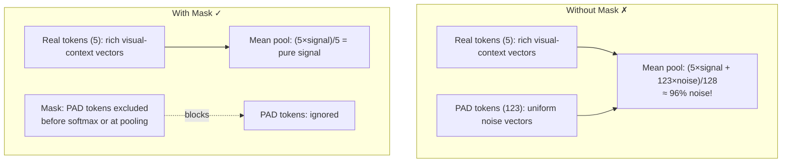

**The fix for cross_attetion** is simpler — MHA accepts `key_padding_mask`:

```python
attn_out, _ = self.cross_attn(
    Q, K, V,
    key_padding_mask=(attention_mask == 0)  # True = ignore this token
)
```

This makes the softmax assign zero probability to masked positions.

---

## 9. Recommendations

### 9.1 Immediate Fixes (Bug-Level)

1. **Add attention mask everywhere**: Pass `key_padding_mask` to `nn.MultiheadAttention`; mask `C` in co-attention before softmax.
2. **Fix filename typo**: Rename `cross_attetion.ipynb` → `cross_attention.ipynb`.
3. **Update deprecated API**: Replace `pretrained=True` with `weights=` parameter.

### 9.2 Architectural Improvements

| Model | Suggestion |
|-------|-----------|
| Baseline | Add LayerNorm before the MLP to normalize CLS activation scales. |
| Co-Attention | Add residual + LayerNorm after co-attention (like cross_attetion does). Try learned pooling (attention-weighted sum) instead of mean. |
| Cross-Attention | Add a reverse direction (Image attends to Text) and concat both outputs for true bidirectionality. |
| Hierarchical | Try a scalar gate instead of element-wise gate for simpler interpretability. Add cross-attention between T_global and V_global. |

### 9.3 Experimental Priorities

1. **Run baseline first** — establishes the lower bound. If baseline gets >80% accuracy, the task may be simple enough that complex fusion adds noise.
2. **Compare co-attention vs cross-attention** — this is the key ablation: bidirectional affinity vs one-way MHA.
3. **Evaluate hierarchical last** — most parameters, highest risk of overfitting on small datasets.

---

## 10. Conclusion

The four models form a **coherent progression** in fusion complexity:

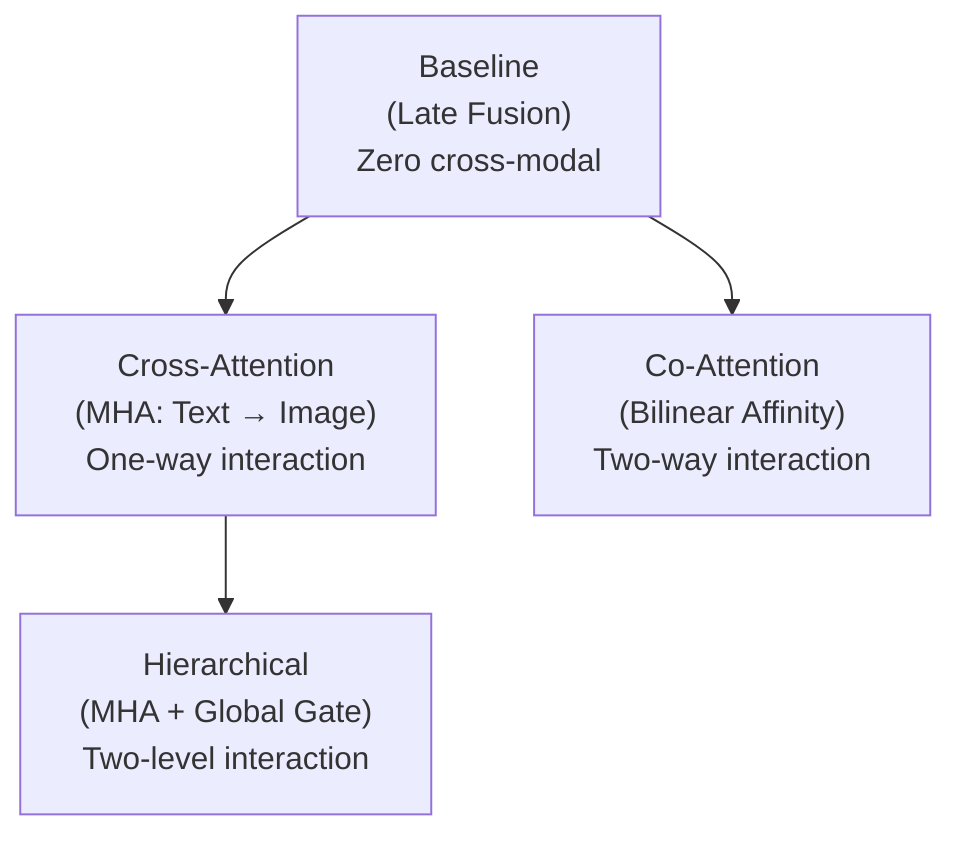

All share identical infrastructure, making them **directly comparable** — any performance difference is attributable to the fusion mechanism alone. The main code quality issue across all models is the **unused attention mask**, which should be fixed before any training runs.

The architecture selection ultimately depends on the dataset characteristics:
- If memes have **simple text-image relationships** → Baseline or Cross-Attention suffices
- If memes require **mutual grounding** (e.g., "the text says X but the image shows Y") → Co-Attention
- If memes need both **word-level alignment and holistic understanding** → Hierarchical

---

*Generated as a comprehensive code review with under-the-hood deep dives. All diagrams use Mermaid syntax.*
